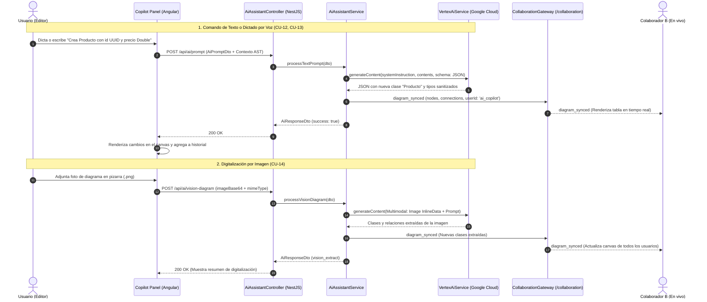

# ✨ Módulo de Asistente Inteligente UML (AI Assistant - Vertex AI Gemini 2.5 Flash)

## 📌 Descripción General
El **Módulo de Asistente IA (Copilot UML)** integra **Google Cloud Vertex AI** mediante el SDK oficial `@google/genai` (utilizando el modelo multimodal **`gemini-2.5-flash`**). Permite interactuar mediante texto en lenguaje natural, dictado por voz y digitalización óptica de imágenes de diagramas UML (pizarras, bocetos o capturas), sincronizando las mutaciones estructurales del canvas en tiempo real vía WebSockets como un colaborador activo más.

---

## 🏛 Arquitectura en 5 Capas (Backend)

```
src/modules/ai-assistant/
├── controllers/          # [Capa 1] Controladores REST & Swagger (AiAssistantController)
├── services/             # [Capa 2] Lógica de Prompts, Guardrails y Difusión (AiAssistantService, VertexAiService)
├── repositories/         # [Capa 3] Acceso a Gateways de Colaboración (CollaborationGateway)
├── entities/             # [Capa 4] Interfaces de Mutación del AST ('UmlClassNode', 'UmlConnection')
└── dtos/                 # [Capa 5] DTOs de Entrada y Salida (AiPromptDto, AiVisionPromptDto, AiResponseDto)
```

---

## 🛡️ Guardrails y Políticas del Asistente IA
1. **Regla de Guardrail Estricta:** El asistente **NO** inventa modelos de negocio genéricos o ambiguos desde cero si el usuario solo narra una historia general (ej: *"este es mi negocio de ventas... hazme el diagrama"*). Si el usuario no proporciona tablas, atributos o relaciones concretas, el asistente responde con `isClarificationRequired: true`, solicitando amablemente especificaciones estructurales o la imagen del diagrama.
2. **Tipos de Datos Fuertemente Validados:** Todo atributo generado debe pertenecer a los tipos predefinidos compatibles con Spring Boot / SQL (`UUID`, `String`, `Integer`, `Long`, `Boolean`, `Double`, `Float`, `BigDecimal`, `LocalDate`, `LocalDateTime`, `Date`, `Text`, `byte[]`).
3. **Co-edición en Tiempo Real:** Toda mutación aprobada por la IA se difunde inmediatamente mediante `CollaborationGateway` al canal `diagram_${diagramId}` con el usuario `✨ Copilot IA (Vertex AI)`, notificando a los demás colaboradores en vivo.

---

## 📋 Casos de Uso del Módulo

### 🔹 CU-12: Asistente IA por Comandos de Texto (Vertex AI)
* **Actor Principal:** `OWNER` o `EDITOR`.
* **Descripción:** Permite ingresar instrucciones en lenguaje natural en el panel Copilot para crear tablas, agregar atributos tipados y establecer relaciones UML 2.5.
* **Flujo Principal:**
  1. El usuario escribe en el panel IA: *"Crea una tabla Producto con id UUID, nombre String, precio Double y conéctala con Categoria con relación de asociación muchos a uno"*.
  2. El frontend envía `POST /api/ai/prompt` con el contexto de nodos y conexiones actuales.
  3. `VertexAiService` procesa el prompt con `gemini-2.5-flash` forzando un esquema JSON estricto.
  4. `AiAssistantService` sanitiza los tipos de datos y valida las coordenadas $(X, Y)$ para evitar superposiciones.
  5. Se transmite `diagram_synced` por WebSockets y se retorna `200 OK` con el AST actualizado.
  6. El canvas se actualiza en pantalla y el historial de mutaciones registra la acción.
* **Flujo Alternativo (Guardrail de Ambigüedad):**
  - Si el usuario ingresa un prompt vago de negocio sin estructura, la IA responde solicitando comandos estructurales concretos sin mutar el canvas.

---

### 🔹 CU-13: Asistente IA por Dictado de Voz / Audio
* **Actor Principal:** `OWNER` o `EDITOR`.
* **Descripción:** Permite dictar instrucciones por voz mediante el micrófono utilizando la Web Speech API nativa, convirtiendo la voz en comandos estructurales para Vertex AI.
* **Flujo Principal:**
  1. El usuario hace clic en el botón de micrófono `🎙️`.
  2. El botón pulsa en rojo con el indicador *"Escuchando tu voz en tiempo real..."*.
  3. El usuario dicta: *"Agrega la clase FacturaDetalle con cantidad Integer y precio_unitario Double"*.
  4. La Web Speech API transcribe el audio al área de texto del prompt.
  5. El usuario envía el comando y Vertex AI aplica la mutación sobre el diagrama.

---

### 🔹 CU-14: Asistente IA por Digitalización de Imagen (Gemini Vision)
* **Actor Principal:** `OWNER` o `EDITOR`.
* **Descripción:** Permite adjuntar una fotografía de una pizarra, boceto en papel o captura de pantalla de un diagrama UML para digitalizarlo automáticamente en clases y relaciones interactivas.
* **Flujo Principal:**
  1. El usuario hace clic en el botón de adjuntar imagen `🖼️` y selecciona un archivo (`.png`, `.jpg`, `.webp`).
  2. El panel muestra la miniatura de la imagen cargada.
  3. El frontend envía `POST /api/ai/vision-diagram` con la imagen en Base64.
  4. Vertex AI Gemini 2.5 Flash analiza visualmente la imagen mediante visión multimodal, extrayendo clases, atributos, métodos y relaciones.
  5. El backend devuelve los nodos y conexiones estructurados, reemplazando o fusionando el modelo y renderizándolo en el lienzo Foblex Flow.

---

### 🔹 CU-15: Co-edición y Difusión en Tiempo Real del Asistente IA
* **Actor Principal:** Todos los Colaboradores conectados (`OWNER`, `EDITOR`, `VIEWER`).
* **Descripción:** Garantiza que cuando un usuario aplica una mutación mediante Copilot IA, todos los demás usuarios de la sala vean la creación o modificación de tablas y reciban el mensaje descriptivo en tiempo real.
* **Flujo Principal:**
  1. El Usuario A ejecuta un comando de IA.
  2. El backend emite `diagram_synced` y `chat_message_received` con el remitente `✨ Copilot IA (Vertex AI)`.
  3. El navegador del Usuario B y del Usuario C (Viewer) actualiza el canvas instantáneamente sin recargar la página.

---

## 📊 Diagrama de Secuencia Mermaid: Asistente IA Multimodal (Texto, Voz, Imagen)



---

## 🧪 Casos de Prueba (Test Cases)

| ID Caso de Prueba | Caso de Uso | Descripción / Escenario | Precondiciones | Datos de Entrada | Pasos de Ejecución | Resultado Esperado | Resultado Real | Estado |
|---|---|---|---|---|---|---|---|:---:|
| **TC_CU12_01** | CU-12 | Creación de tabla y relación mediante comando de texto claro (Camino feliz) | Editor abierto con permisos de edición | `prompt`: "Crea una tabla Producto con id UUID, nombre String, precio Double y conéctala con Categoria con multiplicidad *" | 1. Ingresar texto en panel IA.<br>2. Clic "Ejecutar Comando IA". | Código HTTP `200 OK`, tabla Producto creada con 3 atributos tipados y relación trazada hacia Categoria. | Vertex AI retorna JSON estructurado, canvas actualizado y difundido vía WebSockets. | **Aprobado (Pass)** |
| **TC_CU12_02** | CU-12 | Guardrail: Rechazo de modelo de negocio vago sin estructura (Flujo alterno) | Editor abierto | `prompt`: "Hola, este es mi negocio de compra venta... hazme un diagrama entero" | 1. Ingresar historia de negocio genérica.<br>2. Clic "Ejecutar Comando IA". | Código HTTP `200 OK` con `success: false` y alerta: "⚠️ Por favor especifica las tablas y atributos concretos...". | Guardrail activado; el diagrama no sufre mutaciones erráticas y se orienta al usuario. | **Aprobado (Pass)** |
| **TC_CU13_01** | CU-13 | Dictado de comando por voz mediante Web Speech API (Camino feliz) | Navegador con soporte Web Speech y micrófono habilitado | Audio dictado: "Agrega la clase FacturaDetalle con cantidad Integer y precio_unitario Double" | 1. Clic en botón de micrófono `🎙️`.<br>2. Dictar comando por voz.<br>3. Enviar prompt. | La voz se transcribe en tiempo real al cuadro de texto y Vertex AI genera la clase FacturaDetalle. | Texto capturado con precisión; mutación aplicada al lienzo. | **Aprobado (Pass)** |
| **TC_CU14_01** | CU-14 | Digitalización visual de diagrama UML desde imagen (Camino feliz) | Imagen válida de diagrama en pizarra o captura | Archivo `diagrama_pizarra.png` (Base64) | 1. Clic en botón `🖼️`.<br>2. Seleccionar imagen.<br>3. Clic "Digitalizar Imagen con IA". | Código HTTP `200 OK`, clases y relaciones detectadas en la foto son transformadas a nodos interactivos Foblex Flow. | Gemini Vision extrae las clases con sus compartimentos y las dibuja en el canvas. | **Aprobado (Pass)** |
| **TC_CU15_01** | CU-15 | Difusión en vivo de la mutación de IA hacia los demás colaboradores (Camino feliz) | Dos usuarios conectados en la misma sala de diagrama | Usuario A ejecuta comando de IA en su navegador | 1. Usuario A aplica mutación con Copilot IA. | En la pantalla de Usuario B, las nuevas clases y conexiones aparecen automáticamente en tiempo real. | Evento `diagram_synced` emitido por el Gateway; ambos usuarios sincronizados al instante. | **Aprobado (Pass)** |

---

## 🔌 Especificación de Endpoints REST

| Método | Ruta | Seguridad | HTTP Status | Descripción |
| :--- | :--- | :---: | :---: | :--- |
| `POST` | `/api/ai/prompt` | Bearer JWT | `200 OK` | Procesa un comando de texto o dictado por voz para mutar el diagrama UML con Vertex AI |
| `POST` | `/api/ai/vision-diagram` | Bearer JWT | `200 OK` | Digitaliza y extrae un diagrama UML completo a partir de una imagen usando Gemini Vision |
| `POST` | `/api/ai/audio-prompt` | Bearer JWT | `200 OK` | Procesa un comando transcrito por audio/voz para mutar el diagrama UML |

---

## 📦 Data Transfer Objects (DTOs)

### 1. `AiPromptDto`
```typescript
export class AiPromptDto {
  @ApiProperty({ example: 'Crea una tabla Producto con id UUID, nombre String, precio Double' })
  @IsString()
  @IsNotEmpty()
  prompt: string;

  @ApiProperty({ example: 'd9b736b4-2b62-4217-a068-d0a5180f9702' })
  @IsString()
  @IsNotEmpty()
  diagramId: string;

  @ApiProperty({ required: false, example: 'ROOM-FAC123' })
  @IsOptional()
  @IsString()
  roomCode?: string;

  @ApiProperty({ required: false, type: [Object] })
  @IsOptional()
  @IsArray()
  currentNodes?: any[];

  @ApiProperty({ required: false, type: [Object] })
  @IsOptional()
  @IsArray()
  currentConnections?: any[];
}
```

### 2. `AiVisionPromptDto`
```typescript
export class AiVisionPromptDto {
  @ApiProperty({ example: 'data:image/png;base64,iVBORw0KGgoAAAANSUhEUgAAAA...' })
  @IsString()
  @IsNotEmpty()
  imageBase64: string;

  @ApiProperty({ example: 'image/png', default: 'image/png' })
  @IsString()
  @IsNotEmpty()
  mimeType: string;

  @ApiProperty({ required: false, example: 'Digitaliza el diagrama de la pizarra' })
  @IsOptional()
  @IsString()
  prompt?: string;

  @ApiProperty({ example: 'd9b736b4-2b62-4217-a068-d0a5180f9702' })
  @IsString()
  @IsNotEmpty()
  diagramId: string;

  @ApiProperty({ required: false, example: 'ROOM-FAC123' })
  @IsOptional()
  @IsString()
  roomCode?: string;
}
```

---

## 🧪 Pruebas Unitarias
Se ejecutan mediante `npm test` en backend:
* `ai-assistant.service.spec.ts`: Pruebas de mutación de diagrama, aplicación de guardrails de negocio y extracción visual por imagen.
* `ai-assistant.controller.spec.ts`: Cobertura de endpoints REST HTTP de procesamiento de texto y visión.
