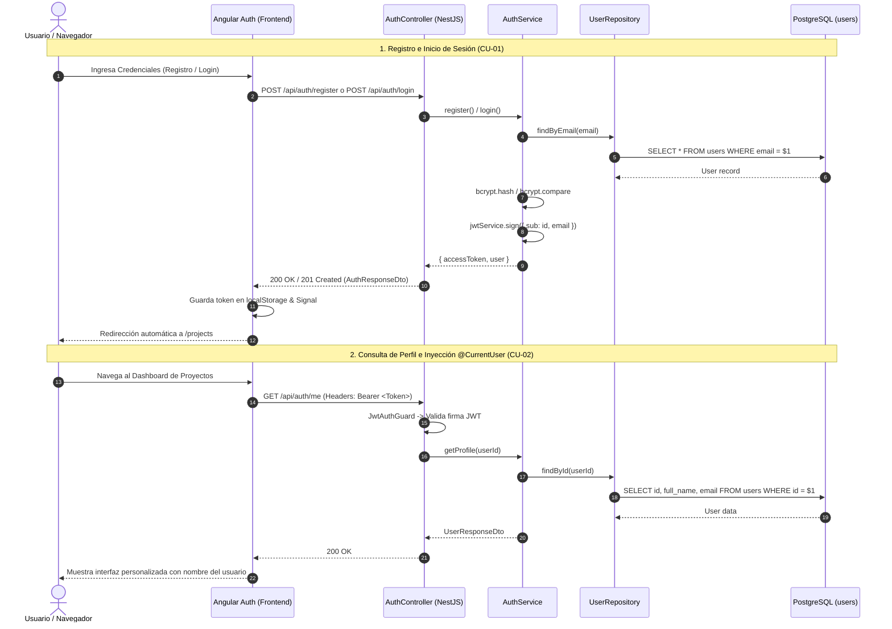

# 🔐 Módulo de Autenticación y Seguridad (Auth Module)

## 📌 Descripción General
El **Módulo de Autenticación** gestiona el ciclo de vida de las cuentas de usuario, el registro e inicio de sesión mediante **JWT (JSON Web Tokens)**, encriptación criptográfica de contraseñas con **bcrypt (salt rounds = 10)** y el control de acceso en backend (NestJS) y frontend (Angular Signals + JWT Interceptors).

---

## 🏛 Arquitectura en 5 Capas (Backend)

```
src/modules/auth/
├── controllers/          # [Capa 1] Controladores REST & Documentación OpenAPI Swagger (AuthController)
├── services/             # [Capa 2] Lógica de Negocio, Criptografía, Emisión JWT (AuthService)
├── repositories/         # [Capa 3] Acceso a Datos TypeORM (UserRepository)
├── entities/             # [Capa 4] Mapeo de la Tabla 'users' (User)
├── dtos/                 # [Capa 5] Data Transfer Objects con Validation Pipes
└── strategies/           # Estrategias Passport (JwtStrategy) y Guards (JwtAuthGuard)
```

---

## 📋 Casos de Uso del Módulo

### 🔹 CU-01: Registro e Inicio de Sesión
* **Actor Principal:** Usuario Invitado / Registrado.
* **Precondición:** Para registro, el correo no debe existir previamente; para inicio de sesión, las credenciales deben ser válidas.
* **Flujo Principal (Registro):**
  1. El usuario completa el formulario de registro con `fullName`, `email` y `password`.
  2. El frontend envía una petición `POST /api/auth/register`.
  3. `ValidationPipe` valida el formato y longitud de los datos.
  4. `AuthService` verifica que no exista un usuario con el mismo email (`UserRepository.findByEmail`).
  5. Se genera el hash criptográfico de la contraseña con `bcrypt.hash(password, 10)` y se persiste el nuevo registro en `users`.
  6. Se genera un token JWT firmado con `JWT_SECRET` (expiración 7 días).
  7. El backend responde con `201 Created` retornando el `accessToken` y la información pública del usuario.
* **Flujo Principal (Inicio de Sesión):**
  1. El usuario ingresa su `email` y `password` en la pantalla de Login.
  2. El frontend envía `POST /api/auth/login`.
  3. `AuthService` busca al usuario por email y compara la contraseña mediante `bcrypt.compare`.
  4. Si las credenciales son válidas, se emite el token JWT y se responde con `200 OK` (`AuthResponseDto`).
  5. El frontend almacena el token en `localStorage`, actualiza el signal `currentUser` y redirige a `/projects`.
* **Flujos Alternativos / Excepciones:**
  - *Email Duplicado:* Se lanza `409 Conflict: El correo ya está registrado`.
  - *Credenciales Inválidas:* Se responde con `401 Unauthorized: Credenciales inválidas`.

---

### 🔹 CU-02: Consulta de Perfil y Verificación de Sesión
* **Actor Principal:** Usuario Autenticado.
* **Precondición:** Petición HTTP con cabecera `Authorization: Bearer <token>`.
* **Flujo Principal:**
  1. El cliente efectúa una petición `GET /api/auth/me`.
  2. `JwtAuthGuard` intercepta la petición y valida la firma y vigencia del JWT con `JwtStrategy`.
  3. Se inyecta la entidad `User` en el controlador mediante el decorador `@CurrentUser()`.
  4. Se responde con `200 OK` conteniendo el perfil saneado del usuario (`UserResponseDto`).
  5. Si el token expiró o es inválido, el frontend captura el error `401 Unauthorized` mediante `JwtInterceptor` y redirige automáticamente al login.

---

## 📊 Diagrama de Secuencia Mermaid: Autenticación y Autorización



---

## 🔌 Especificación de Endpoints REST

| Método | Ruta | Seguridad | HTTP Status | Descripción |
| :--- | :--- | :---: | :---: | :--- |
| `POST` | `/api/auth/register` | Pública (`@Public()`) | `201 Created` | Registra una nueva cuenta de usuario y retorna token JWT |
| `POST` | `/api/auth/login` | Pública (`@Public()`) | `200 OK` | Valida credenciales (email/password) y retorna token JWT |
| `GET` | `/api/auth/me` | Bearer JWT | `200 OK` | Retorna los datos del perfil del usuario autenticado |

---

## 📦 Data Transfer Objects (DTOs)

### 1. `RegisterDto`
```typescript
export class RegisterDto {
  @ApiProperty({ example: 'Evert Rodriguez' })
  @IsString()
  @IsNotEmpty()
  @MaxLength(100)
  fullName: string;

  @ApiProperty({ example: 'evert@uagrm.edu.bo' })
  @IsEmail()
  @IsNotEmpty()
  @MaxLength(150)
  email: string;

  @ApiProperty({ example: 'Pass1234!', minLength: 6 })
  @IsString()
  @IsNotEmpty()
  @MinLength(6)
  password: string;
}
```

### 2. `LoginDto`
```typescript
export class LoginDto {
  @ApiProperty({ example: 'evert@uagrm.edu.bo' })
  @IsEmail()
  @IsNotEmpty()
  email: string;

  @ApiProperty({ example: 'Pass1234!' })
  @IsString()
  @IsNotEmpty()
  @MinLength(6)
  password: string;
}
```

---

## 🧪 Pruebas Unitarias
Cobertura ejecutada mediante `npm test` en backend:
* `auth.service.spec.ts`: Pruebas de registro exitoso, control de email duplicado, hashing bcrypt y emisión de JWT.
* `auth.controller.spec.ts`: Pruebas de endpoints HTTP de registro, login y perfil con mocks de servicio.
