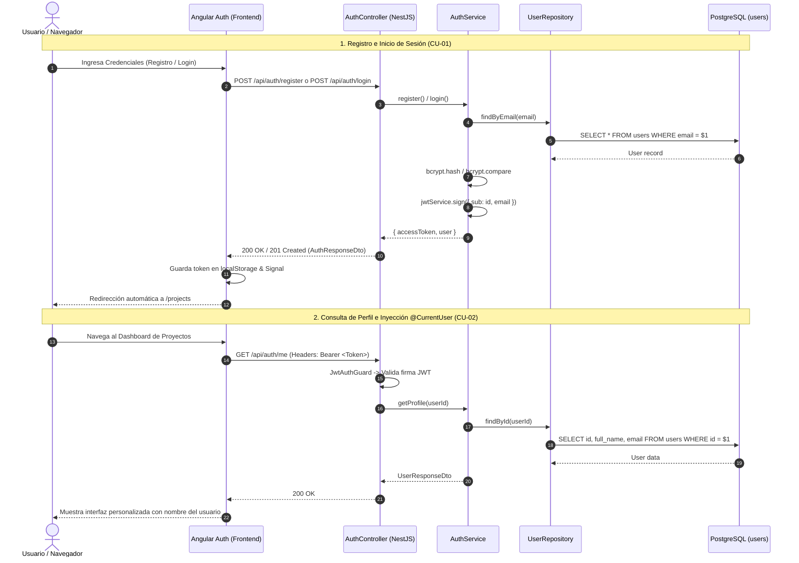

# 🔐 Módulo de Autenticación y Seguridad (Auth Module)

## 📌 Descripción General
El **Módulo de Autenticación** gestiona el ciclo de vida de las cuentas de usuario, el registro e inicio de sesión mediante **JWT (JSON Web Tokens)**, encriptación criptográfica de contraseñas con **bcrypt (salt rounds = 10)** y el control de acceso en backend (NestJS) y frontend (Angular Signals + JWT Interceptors).

---

## 🏛 Arquitectura en 5 Capas (Backend)

```
src/modules/auth/
├── controllers/          # [Capa 1] Controladores REST & Documentación OpenAPI Swagger (AuthController)
├── services/             # [Capa 2] Lógica de Negocio, Criptografía, Emisión JWT (AuthService)
├── repositories/         # [Capa 3] Acceso a Datos TypeORM (UserRepository)
├── entities/             # [Capa 4] Mapeo de la Tabla 'users' (User)
├── dtos/                 # [Capa 5] Data Transfer Objects con Validation Pipes
└── strategies/           # Estrategias Passport (JwtStrategy) y Guards (JwtAuthGuard)
```

---

## 📋 Casos de Uso del Módulo

### 🔹 CU-01: Gestión de Autenticación y Sesión de Usuario
* **Actor Principal:** `A1, A2` (Ingeniero Anfitrión / Ingeniero Colaborador).
* **Prioridad:** `ALTA`
* **Precondición:** Para registro, el correo no debe existir previamente; para inicio de sesión y consulta de perfil, credenciales válidas y cabecera `Authorization: Bearer <token>`.
* **Flujo Principal (Registro de Usuario):**
  1. El usuario completa el formulario de registro con `fullName`, `email` y `password`.
  2. El frontend envía una petición `POST /api/auth/register`.
  3. `ValidationPipe` valida el formato y longitud de los datos.
  4. `AuthService` verifica que no exista un usuario con el mismo email (`UserRepository.findByEmail`).
  5. Se genera el hash criptográfico de la contraseña con `bcrypt.hash(password, 10)` y se persiste el nuevo registro en `users`.
  6. Se genera un token JWT firmado con `JWT_SECRET` (expiración 7 días).
  7. El backend responde con `201 Created` retornando el `accessToken` y la información pública del usuario.
* **Flujo Principal (Inicio de Sesión y Emisión de Token):**
  1. El usuario ingresa su `email` y `password` en la pantalla de Login.
  2. El frontend envía `POST /api/auth/login`.
  3. `AuthService` busca al usuario por email y compara la contraseña mediante `bcrypt.compare`.
  4. Si las credenciales son válidas, se emite el token JWT y se responde con `200 OK` (`AuthResponseDto`).
  5. El frontend almacena el token en `localStorage`, actualiza el signal `currentUser` y redirige a `/projects`.
* **Flujo Principal (Consulta de Perfil y Validación de Sesión Activa):**
  1. El cliente efectúa una petición `GET /api/auth/me`.
  2. `JwtAuthGuard` intercepta la petición y valida la firma y vigencia del JWT con `JwtStrategy`.
  3. Se inyecta la entidad `User` en el controlador mediante el decorador `@CurrentUser()`.
  4. Se responde con `200 OK` conteniendo el perfil saneado del usuario (`UserResponseDto`).
  5. Si el token expiró o es inválido, el frontend captura el error `401 Unauthorized` mediante `JwtInterceptor` y redirige automáticamente al login.
* **Flujos Alternativos / Excepciones:**
  - *Email Duplicado:* Se lanza `409 Conflict: El correo ya está registrado`.
  - *Credenciales Inválidas:* Se responde con `401 Unauthorized: Credenciales inválidas`.

---

## 📊 Diagrama de Secuencia Mermaid: Autenticación y Autorización



---

## 🧪 Casos de Prueba (Test Cases)

| ID Caso de Prueba | Caso de Uso | Descripción / Escenario | Precondiciones | Datos de Entrada | Pasos de Ejecución | Resultado Esperado | Resultado Real | Estado |
|---|---|---|---|---|---|---|---|:---:|
| **TC_CU01_01** | CU-01 | Registro exitoso de nuevo usuario (Camino feliz) | Correo no registrado previamente en la base de datos | `fullName`: "Evert Rodriguez", `email`: "nuevo@uagrm.edu.bo", `password`: "Pass1234!" | 1. Completar formulario de registro.<br>2. Clic en "Crear Cuenta". | Código HTTP `201 Created`, token JWT emitido y redirección a `/projects`. | Usuario creado exitosamente en tabla `users`, token almacenado y redirección efectuada. | **Aprobado (Pass)** |
| **TC_CU01_02** | CU-01 | Registro con correo electrónico duplicado (Flujo alterno) | Usuario "evert@uagrm.edu.bo" ya existe en BD | `fullName`: "Evert Duplicado", `email`: "evert@uagrm.edu.bo", `password`: "Pass1234!" | 1. Ingresar correo ya registrado.<br>2. Clic en "Crear Cuenta". | Código HTTP `409 Conflict` con mensaje "El correo electrónico ya está registrado". | Retorna error 409 y frontend muestra alerta de email en uso. | **Aprobado (Pass)** |
| **TC_CU01_03** | CU-01 | Registro con contraseña inválida menor a 6 caracteres (Datos inválidos) | Ninguna | `fullName`: "Carlos", `email`: "carlos@uagrm.edu.bo", `password`: "123" | 1. Ingresar clave con longitud de 3 caracteres.<br>2. Clic en "Crear Cuenta". | Código HTTP `400 Bad Request` indicando "password must be longer than or equal to 6 characters". | ValidationPipe rechaza la petición con mensaje de validación. | **Aprobado (Pass)** |
| **TC_CU01_04** | CU-01 | Inicio de sesión exitoso con credenciales correctas (Camino feliz) | Usuario activo en base de datos con contraseña hasheada | `email`: "evert@uagrm.edu.bo", `password`: "Pass1234!" | 1. Ingresar credenciales.<br>2. Clic en "Iniciar Sesión". | Código HTTP `200 OK`, retorno de `accessToken` y perfil de usuario. | Sesión iniciada correctamente, `currentUser` actualizado en signal. | **Aprobado (Pass)** |
| **TC_CU01_05** | CU-01 | Inicio de sesión con contraseña incorrecta (Flujo alterno) | Usuario registrado | `email`: "evert@uagrm.edu.bo", `password`: "WrongPassword!" | 1. Ingresar correo y clave errónea.<br>2. Clic en "Iniciar Sesión". | Código HTTP `401 Unauthorized` con mensaje "Credenciales inválidas". | Retorna 401 y muestra mensaje de error sin revelar detalles internos. | **Aprobado (Pass)** |
| **TC_CU01_06** | CU-01 | Consulta de perfil con Bearer JWT válido (Camino feliz) | Token JWT emitido y vigente en cabecera HTTP | Header: `Authorization: Bearer <token_valido>` | 1. Realizar petición `GET /api/auth/me`. | Código HTTP `200 OK` con datos del usuario autenticado sin password_hash. | Retorna objeto con `id`, `fullName`, `email` y `createdAt`. | **Aprobado (Pass)** |
| **TC_CU01_07** | CU-01 | Consulta de perfil sin token o con token expirado (Flujo alterno) | Token expirado o ausente | Header: `Authorization: Bearer <token_invalido>` | 1. Realizar petición `GET /api/auth/me`. | Código HTTP `401 Unauthorized`. Frontend redirige a `/login`. | JwtAuthGuard rechaza la petición y frontend limpia sesión. | **Aprobado (Pass)** |

---

## 🔌 Especificación de Endpoints REST

| Método | Ruta | Seguridad | HTTP Status | Descripción |
| :--- | :--- | :---: | :---: | :--- |
| `POST` | `/api/auth/register` | Pública (`@Public()`) | `201 Created` | Registra una nueva cuenta de usuario y retorna token JWT |
| `POST` | `/api/auth/login` | Pública (`@Public()`) | `200 OK` | Valida credenciales (email/password) y retorna token JWT |
| `GET` | `/api/auth/me` | Bearer JWT | `200 OK` | Retorna los datos del perfil del usuario autenticado |

---

## 📦 Data Transfer Objects (DTOs)

### 1. `RegisterDto`
```typescript
export class RegisterDto {
  @ApiProperty({ example: 'Evert Rodriguez' })
  @IsString()
  @IsNotEmpty()
  @MaxLength(100)
  fullName: string;

  @ApiProperty({ example: 'evert@uagrm.edu.bo' })
  @IsEmail()
  @IsNotEmpty()
  @MaxLength(150)
  email: string;

  @ApiProperty({ example: 'Pass1234!', minLength: 6 })
  @IsString()
  @IsNotEmpty()
  @MinLength(6)
  password: string;
}
```

### 2. `LoginDto`
```typescript
export class LoginDto {
  @ApiProperty({ example: 'evert@uagrm.edu.bo' })
  @IsEmail()
  @IsNotEmpty()
  email: string;

  @ApiProperty({ example: 'Pass1234!' })
  @IsString()
  @IsNotEmpty()
  @MinLength(6)
  password: string;
}
```
