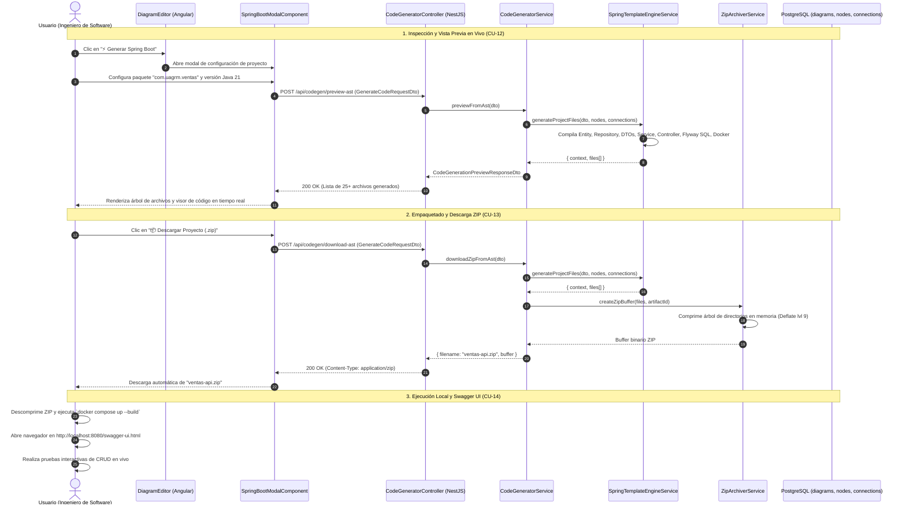

# 🚀 Módulo de Generación de Código Backend (Code Generator Module)

## 📌 Descripción General
El **Módulo de Generación de Código Backend** transforma el Árbol de Sintaxis Abstracta (**AST**) de diagramas de clases UML y modelos entidad-relación en una arquitectura de software completa, desacoplada y lista para producción en **Spring Boot 4 / 3.4.x + PostgreSQL (Flyway)**.

A partir de las clases, atributos, métodos, tipos de datos y relaciones ($1:1$, $1:N$, $N:M$) modelados en el canvas, el motor compila automáticamente las 5 capas de la aplicación con validaciones Jakarta, manejo transaccional `@Transactional`, interfaces de repositorio `JpaRepository`, endpoints REST documentados interactivamente con **OpenAPI / Swagger UI**, scripts SQL de migración inicial para Flyway, contenedor `Dockerfile` multi-stage y orquestación con `docker-compose.yml`.

---

## 🏛 Arquitectura en 5 Capas (Backend)

```
src/modules/code-generator/
├── controllers/          # [Capa 1] Endpoints REST & Swagger (CodeGeneratorController)
├── services/             # [Capa 2] Motores de Compilación y Compresión (CodeGeneratorService, SpringTemplateEngineService, ZipArchiverService)
├── templates/            # [Capa 3] Plantillas de Renderizado Java, SQL, YAML, XML y Docker
├── entities/             # [Capa 4] Modelos de Dominio y AST
└── dtos/                 # [Capa 5] DTOs de Solicitud y Vista Previa (GenerateCodeRequestDto, CodeGenerationPreviewResponseDto)
```

---

## 📐 Capas y Archivos Generados en la Solución Spring Boot

| Capa / Componente | Archivo / Formato | Propósito y Anotaciones Principales |
| :--- | :--- | :--- |
| **Entidades JPA** | `${ClassName}.java` | `@Entity`, `@Table`, `@Id`, `@GeneratedValue(UUID/IDENTITY)`, `@Column`, `@ManyToOne`, `@OneToMany`, `@ManyToMany`. |
| **Repositorios** | `${ClassName}Repository.java` | `@Repository`, `JpaRepository<Entity, IdType>`, derivación de consultas automáticas (`findBy...`). |
| **DTOs de Entrada** | `Create${ClassName}Dto.java`, `Update${ClassName}Dto.java` | Objetos de transferencia con validaciones `@NotBlank`, `@NotNull`, `@Min` y separación de IDs. |
| **DTOs de Salida** | `${ClassName}ResponseDto.java` | Proyección de datos limpia con método de mapeo estático `fromEntity(...)` que previene ciclos JSON infinitos. |
| **Servicios** | `${ClassName}Service.java`, `${ClassName}ServiceImpl.java` | Interfaces de negocio e implementaciones `@Service @Transactional` con operaciones CRUD completas. |
| **Controladores REST** | `${ClassName}Controller.java` | `@RestController`, `@RequestMapping("/api/v1/...")`, `@Tag`, `@Operation`, `@ApiResponse` (Swagger-UI). |
| **Excepciones** | `GlobalExceptionHandler.java`, `ResourceNotFoundException.java` | `@RestControllerAdvice` para estandarizar respuestas de error HTTP 400, 404 y 500 en formato JSON uniforme. |
| **Migración Flyway** | `V1__create_tables.sql` | DDL con extensión `pgcrypto`, `CREATE TABLE`, `PRIMARY KEY`, `FOREIGN KEY` e índices `CREATE INDEX`. |
| **Configuración** | `application.yml`, `pom.xml` | Configuración DataSource PostgreSQL, DDL `validate`, Flyway activo y Swagger-UI en `/swagger-ui.html`. |
| **Contenedores** | `Dockerfile`, `docker-compose.yml` | Build multi-stage con Maven + Eclipse Temurin JRE 21 y contenedor PostgreSQL 16 con healthcheck. |
| **Documentación** | `README.md` | Guía de inicio rápido para ejecución local con Maven (`./mvnw spring-boot:run`) o Docker (`docker compose up`). |

---

## 📋 Casos de Uso del Módulo

### 🔹 CU-12: Vista Previa de Arquitectura y Código Spring Boot en Vivo
* **Actor Principal:** Usuario Autenticado (`OWNER`, `EDITOR`, `VIEWER`).
* **Descripción:** Permite inspeccionar en tiempo real todos los archivos generados en las 5 capas arquitectónicas antes de descargarlos.
* **Flujo Principal:**
  1. El usuario hace clic en el botón `⚡ Generar Spring Boot` en la barra superior.
  2. El frontend envía la solicitud a `POST /api/codegen/preview/:diagramId` o `POST /api/codegen/preview-ast`.
  3. El motor `SpringTemplateEngineService` compila el AST y retorna la lista estructurada de archivos con su capa y contenido.
  4. El modal interactivo presenta un explorador de árbol de archivos y un visor de código con copia al portapapeles.

---

### 🔹 CU-13: Compilación y Descarga del Proyecto en Formato ZIP
* **Actor Principal:** Usuario Autenticado (`OWNER`, `EDITOR`, `VIEWER`).
* **Descripción:** Genera y empaqueta en memoria la estructura completa del proyecto Maven/Spring Boot en un archivo `.zip` comprimido.
* **Flujo Principal:**
  1. El usuario presiona el botón `📦 Descargar Proyecto Spring Boot (.zip)`.
  2. El sistema empaqueta en memoria todos los archivos fuente Java, recursos `db/migration`, `pom.xml`, `application.yml`, `Dockerfile` y `docker-compose.yml` utilizando `ZipArchiverService`.
  3. El navegador descarga automáticamente el archivo `${artifact_name}.zip` listo para descomprimir y ejecutar.

---

### 🔹 CU-14: Despliegue Automatizado con Docker Compose y Pruebas en Swagger UI
* **Actor Principal:** Desarrollador / Usuario Final.
* **Descripción:** Ejecución inmediata de la base de datos relacional PostgreSQL y la API REST en contenedores aislados con documentación Swagger interactiva.
* **Flujo Principal:**
  1. El usuario descomprime el archivo `.zip` y ejecuta `docker compose up --build` en su terminal.
  2. Docker construye el JAR multi-stage y levanta el contenedor PostgreSQL 16.
  3. Flyway ejecuta la migración `V1__create_tables.sql` creando el esquema relacional con sus foreign keys.
  4. El usuario accede a `http://localhost:8080/swagger-ui.html` para ejecutar peticiones GET, POST, PUT y DELETE en tiempo real.

---

## 📊 Diagrama de Secuencia Mermaid: Generación y Descarga de Código



---

## 🧪 Pruebas Unitarias del Módulo

* **`SpringTemplateEngineService`:** Valida la correcta generación de las 5 capas, tipos de datos Java/SQL, relaciones JPA `@ManyToOne`/`@OneToMany`/`@ManyToMany`, Flyway SQL, `Dockerfile`, `docker-compose.yml` y `pom.xml`.
* **`CodeGeneratorService`:** Valida la resolución de permisos por proyecto y empaquetado ZIP en memoria.
* **`CodeGeneratorController`:** Valida los endpoints REST de vista previa y descarga directa.
* **Resultado:** **83/83 tests unitarios aprobados al 100%** en el backend.
