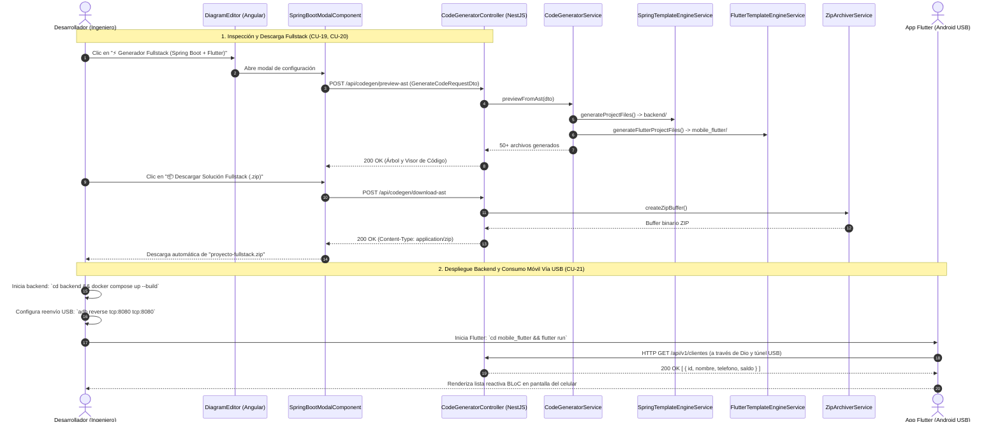

# 🚀 Módulo de Generación de Código Fullstack: Spring Boot 4 & Flutter Mobile App

## 📌 Descripción General
El **Módulo de Generación de Código** transforma el Árbol de Sintaxis Abstracta (**AST**) de diagramas de clases UML y modelos entidad-relación en soluciones de software completas, desacopladas y listas para producción:

1. **Backend REST Microservice:** Desarrollado en **Spring Boot 3.4.0 / 4 + Java 21 + PostgreSQL 16**, con arquitectura limpia en 5 capas, migraciones Flyway (`V1__create_tables.sql`), contenedor `Dockerfile` multi-stage, orquestación con `docker-compose.yml` y documentación interactiva **Swagger UI** en `/swagger-ui.html`.
2. **Frontend Móvil Multiplataforma:** Desarrollado en **Flutter (Dart)** siguiendo **Clean Architecture**, con gestor de estado **BLoC** (`flutter_bloc`), cliente HTTP **Dio** con interceptores de logging y reintentos, programación funcional con **Dartz** (`Either<Failure, T>`), inyección de dependencias con **GetIt** (`injection_container.dart`), y soporte para consumo local vía cable USB (`adb reverse tcp:8080 tcp:8080`) o emulador (`10.0.2.2`).

---

## 🏛 Arquitectura en 5 Capas (Backend Spring Boot)

```text
backend/src/modules/code-generator/
├── controllers/          # [Capa 1] Endpoints REST & Swagger (CodeGeneratorController)
├── services/             # [Capa 2] Motores de Compilación (SpringTemplateEngineService, FlutterTemplateEngineService, ZipArchiverService)
├── templates/            # [Capa 3] Plantillas de Renderizado Java, SQL, YAML, XML, Docker y Flutter
│   ├── flutter/          # Plantillas de Clean Architecture Dart (Core, Entity, Model, DataSource, Repo, UseCases, BLoC, UI)
│   ├── entity.template.ts
│   ├── repository.template.ts
│   ├── dto.template.ts
│   ├── service.template.ts
│   └── controller.template.ts
├── entities/             # [Capa 4] Modelos de Dominio y AST
└── dtos/                 # [Capa 5] DTOs de Solicitud y Vista Previa (GenerateCodeRequestDto, CodeGenerationPreviewResponseDto)
```

---

## 📱 Arquitectura Limpia en Flutter (Clean Architecture + BLoC)

```text
lib/
├── core/
│   ├── constants/
│   │   └── api_constants.dart          # URLs base, timeouts y endpoints REST (con soporte para localhost / 10.0.2.2 / USB host)
│   ├── errors/
│   │   ├── exceptions.dart             # ServerException, NetworkException, NotFoundException
│   │   └── failures.dart               # Failure, ServerFailure, NetworkFailure, NotFoundFailure
│   ├── network/
│   │   └── api_client.dart             # Instancia de Dio con interceptores y logging
│   └── theme/
│       └── app_theme.dart              # Colores, tipografía y estilos globales Material 3
│
├── features/                           # Un módulo independiente por cada entidad del diagrama UML
│   ├── [entidad]/
│   │   ├── data/
│   │   │   ├── datasources/
│   │   │   │   └── [entidad]_remote_datasource.dart
│   │   │   ├── models/
│   │   │   │   ├── [entidad]_model.dart          # Serialización JSON (fromJson / toJson)
│   │   │   │   └── [entidad]_request_model.dart  # DTOs de solicitud para Create / Update
│   │   │   └── repositories/
│   │   │       └── [entidad]_repository_impl.dart
│   │   ├── domain/
│   │   │   ├── entities/
│   │   │   │   └── [entidad]_entity.dart         # Entidad pura inmutable de Dart (Equatable)
│   │   │   ├── repositories/
│   │   │   │   └── [entidad]_repository.dart     # Contrato de repositorio con Either<Failure, T>
│   │   │   └── usecases/
│   │   │       ├── get_[entidades]_usecase.dart
│   │   │       ├── get_[entidad]_by_id_usecase.dart
│   │   │       ├── create_[entidad]_usecase.dart
│   │   │       ├── update_[entidad]_usecase.dart
│   │   └── presentation/
│   │       ├── bloc/
│   │       │   ├── [entidad]_bloc.dart           # Máquina de estados reactiva BLoC
│   │       │   ├── [entidad]_event.dart
│   │       │   └── [entidad]_state.dart
│   │       ├── pages/
│   │       │   ├── [entidad]_list_page.dart      # Lista con Pull-to-Refresh y Card actions
│   │       │   └── [entidad]_form_page.dart      # Formulario reactivo de creación y edición
│   │       └── widgets/
│   │           └── [entidad]_card_widget.dart
│
├── injection_container.dart            # Service Locator GetIt (sl)
└── main.dart                           # Inicialización, MultiBlocProvider y MaterialApp
```

---

## 📋 Casos de Uso del Módulo

### 🔹 CU-13. Vista Previa de Arquitectura Fullstack en Vivo

| Campo | Detalle |
| :--- | :--- |
| **Nombre de CU** | CU-13. Vista Previa de Arquitectura Fullstack en Vivo |
| **Propósito** | Permitir a los ingenieros inspeccionar interactivamente todo el código fuente generado por capas tanto para Spring Boot 4 como para Flutter antes de su descarga. |
| **Actores** | A1 (Ingeniero Anfitrión), A2 (Ingeniero Colaborador / VIEWER) |
| **Actor iniciador** | A1 o A2 |
| **Precondición** | Diagrama UML con al menos una clase definida con atributos y tipos. |
| **Flujo principal** | **Abrir Modal de Generación Fullstack:**<br>• Clic en el botón `⚡ Generador Fullstack (Spring Boot + Flutter)` en la barra superior.<br><br>**Compilar AST a Código:**<br>• El frontend solicita `POST /api/codegen/preview-ast`.<br>• Los motores `SpringTemplateEngineService` y `FlutterTemplateEngineService` generan en memoria las estructuras completas.<br><br>**Explorar Árbol de Archivos:**<br>• El usuario navega por las carpetas y archivos en el árbol lateral clasificado por capas (*Entities*, *Repositories*, *DTOs*, *Services*, *Controllers*, *Flyway SQL*, *Docker*, *BLoC*, *Pages*, *Widgets*).<br><br>**Inspeccionar Código con Resaltado de Sintaxis:**<br>• Al hacer clic sobre cualquier archivo, el visor central renderiza el código fuente exacto con números de línea y tipografía monospace.<br><br>**Filtrar por Plataforma:**<br>• Alternar entre vistas *Solución Completa*, *Spring Boot Backend* o *Flutter Mobile*. |
| **Postcondición** | Código fuente inspeccionado y validado en pantalla sin descargar archivos locales. |
| **Excepción** | • **Diagrama Vacío:** Alerta indicando que se requiere al menos una clase para compilar la solución. |

---

### 🔹 CU-14. Compilación y Descarga del Proyecto Fullstack en ZIP

| Campo | Detalle |
| :--- | :--- |
| **Nombre de CU** | CU-14. Compilación y Descarga del Proyecto Fullstack en ZIP |
| **Propósito** | Compilar, generar y empaquetar en memoria la solución completa de backend Spring Boot 4 y frontend móvil Flutter Clean Architecture en un archivo comprimido `.zip` listo para producción, Docker y depuración USB. |
| **Actores** | A1 (Ingeniero Anfitrión), A2 (Ingeniero Colaborador) |
| **Actor iniciador** | A1 o A2 |
| **Precondición** | Diagrama de clases válido modelado en el workspace. |
| **Flujo principal** | **Solicitar Descarga Fullstack:**<br>• Clic en `📦 Descargar Solución Fullstack (.zip)` en el modal del generador.<br><br>**Empaquetado en Memoria:**<br>• `ZipArchiverService` comprime en memoria:<br>  1. `backend/`: Código fuente Spring Boot 4 + JPA, migraciones Flyway SQL, Swagger OpenAPI, Dockerfile y `docker-compose.yml`.<br>  2. `mobile_flutter/`: Clean Architecture (Data, Domain, Presentation), GetIt Service Locator, Dio HTTP client, BLoC State Management y runners nativos Android / Linux.<br><br>**Descarga de Artefacto:**<br>• El navegador descarga automáticamente `${project_name}-fullstack.zip`.<br><br>**Despliegue y Conexión USB:**<br>• Descomprimir el ZIP y levantar backend con `docker compose up --build`.<br>• Conectar celular Android por USB y ejecutar `adb reverse tcp:8080 tcp:8080`.<br>• Iniciar app móvil con `flutter run`; Flutter consume la API local en `http://localhost:8080/api/v1` vía túnel USB. |
| **Postcondición** | Archivo `.zip` descargado y ejecutable en local y móvil sin dependencias faltantes. |
| **Excepción** | • **Falla de Empaquetado:** Notificación de error en servidor sin interrumpir la sesión del usuario. |

---

## 📊 Diagrama de Secuencia Mermaid: Generación Fullstack y Consumo Móvil USB



---

## 🧪 Casos de Prueba (Test Cases)

| ID Caso de Prueba | Caso de Uso | Descripción / Escenario | Precondiciones | Datos de Entrada | Pasos de Ejecución | Resultado Esperado | Resultado Real | Estado |
|---|---|---|---|---|---|---|---|:---:|
| **TC_CU13_01** | CU-13 | Vista previa de arquitectura Spring Boot y Flutter (Camino feliz) | Diagrama activo con clases y relaciones | `POST /api/codegen/preview-ast` | 1. Clic en "⚡ Generador Fullstack".<br>2. Modal consulta la vista previa. | Código HTTP `200 OK`, lista de archivos clasificados por capas y tecnologías. | Árbol de archivos y código fuente renderizado en visor interactivo. | **Aprobado (Pass)** |
| **TC_CU13_02** | CU-13 | Filtrado por tecnología en vista previa (Spring / Flutter) | Modal de generador abierto | Selector de plataforma: `flutter` | 1. Seleccionar tab "Flutter Mobile". | Solo se muestran archivos de la arquitectura limpia de Flutter (BLoC, UseCases, Data). | Vista filtrada correctamente sin archivos de Spring Boot. | **Aprobado (Pass)** |
| **TC_CU14_01** | CU-14 | Compilación y descarga de ZIP Fullstack (Camino feliz) | Diagrama con clases en canvas | `POST /api/codegen/download-ast` | 1. Clic en "📦 Descargar Solución Fullstack (.zip)". | Código HTTP `200 OK` (application/zip), descarga automática de `${artifact_name}.zip`. | Archivo ZIP generado en memoria con carpetas `backend/` y `mobile_flutter/`. | **Aprobado (Pass)** |
| **TC_CU14_02** | CU-14 | Integridad de artefactos Docker y Flyway en el ZIP | ZIP descargado | Contenido de `backend/` | 1. Descomprimir ZIP.<br>2. Verificar `docker-compose.yml` y migraciones SQL. | Archivos de configuración de Postgres, Flyway SQL y Dockerfile listos para levantar. | Estructura validada con dependencias y scripts de base de datos intactos. | **Aprobado (Pass)** |
| **TC_CU14_03** | CU-14 | Conexión móvil Flutter hacia API local vía túnel USB / ADB | Backend corriendo en `localhost:8080` y celular conectado | Comando `adb reverse tcp:8080 tcp:8080` | 1. Ejecutar reverse ADB.<br>2. Iniciar `flutter run`. | Flutter consume la API local en `http://localhost:8080/api/v1` sin errores de red. | Peticiones HTTP 200 recibidas y datos listados reactivamente en la app. | **Aprobado (Pass)** |
