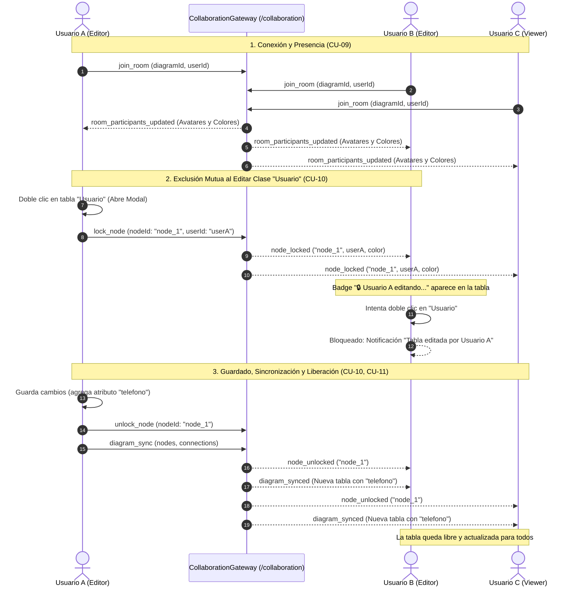

# 📡 Módulo de Colaboración en Tiempo Real (WebSockets, Sincronización & Exclusión Mutua)

## 📌 Descripción General
El **Módulo de Colaboración** gestiona las sesiones concurrentes de modelado UML en tiempo real sobre el mismo diagrama, ofreciendo:
1. **Presencia y cursores en vivo:** Transmisión de coordenadas del cursor `(x, y)` con nombres y colores diferenciados para cada colaborador.
2. **Sincronización reactiva del lienzo:** Propagación multicanal inmediata de mutaciones sobre nodos, atributos, métodos y conexiones entre los clientes conectados a la sala.
3. **Exclusión Mutua y Bloqueo de Tablas (Node-Level Locking):** Protocolo de bloqueo exclusivo temporal al abrir el modal de edición de una tabla para prevenir condiciones de carrera y sobreescrituras destructivas.
4. **Control de Acceso por Roles:** Aplicación estricta de permisos en el canvas para `OWNER`, `EDITOR` y `VIEWER` (Modo Espectador / Solo Lectura).
5. **Persistencia de sesiones activas:** Registro en PostgreSQL de sesiones activas (`collaboration_sessions`) y participantes (`session_participants`).

---

## 🏛 Arquitectura en 5 Capas (Backend)

```
modules/collaboration/
├── entities/
│   ├── collaboration-session.entity.ts # Sesión de sala activa vinculada a un diagrama
│   └── session-participant.entity.ts    # Participante con color de cursor y estado de conexión
├── dtos/
│   ├── join-room.dto.ts                 # DTO para unirse o iniciar sala
│   ├── cursor-position.dto.ts           # DTO para coordenadas del cursor
│   └── session-response.dto.ts          # Respuesta estructurada con participantes
├── repositories/
│   └── session.repository.ts            # Operaciones de persistencia TypeORM
├── services/
│   └── yjs-sync.service.ts              # Lógica de asignación de salas, colores y estados
├── gateways/
│   └── collaboration.gateway.ts         # Gateway WebSocket Socket.io (/collaboration) con mapa de bloqueos
└── controllers/
    └── collaboration.controller.ts      # Endpoints REST para consulta y gestión de sesiones
```

---

## 📋 Casos de Uso del Módulo

### 🔹 CU-06. Sincronización de Presencia, Cursores y Mutaciones del Diagrama

| Campo | Detalle |
| :--- | :--- |
| **Nombre de CU** | CU-06. Sincronización de Presencia, Cursores y Mutaciones del Diagrama |
| **Propósito** | Fundir la presencia visual en tiempo real (avatares y punteros de ratón a ~40 FPS) con la co-edición reactiva bidireccional y la experiencia en vivo para observadores (`VIEWER`). |
| **Actores** | A1 (Ingeniero Anfitrión), A2 (Ingeniero Colaborador / VIEWER), A3 (Agente IA) |
| **Actor iniciador** | A1, A2 o A3 |
| **Precondición** | Conexión WebSocket establecida con el Gateway `/collaboration`. |
| **Flujo principal** | **Unirse a la Sala de Colaboración:**<br>• Al entrar al editor, el cliente emite `join_room` con `{ diagramId, userId, userName, color }`.<br>• El servidor difunde `room_participants_updated`; se renderizan los avatares activos en la barra superior.<br><br>**Transmitir y Renderizar Cursores:**<br>• Al mover el ratón sobre el canvas, el cliente emite `cursor_move` con throttle.<br>• Los demás participantes visualizan el puntero flotante con el nombre y color de cada colaborador.<br><br>**Co-edición Reactiva de Mutaciones:**<br>• Cuando un usuario arrastra una clase (`node_drag`) o modifica el diagrama, se difunde `diagram_synced`.<br>• Todos los navegadores actualizan su lienzo instantáneamente sin recargar la página.<br><br>**Modo Espectador (VIEWER):**<br>• Usuarios con rol `VIEWER` observan todas las mutaciones en vivo pero mantienen deshabilitadas las herramientas de creación, edición y guardado. |
| **Postcondición** | Estado visual sincronizado fielmente entre todos los participantes conectados. |
| **Excepción** | • **Desconexión Inesperada:** El servidor emite `user_left` al detectar caída del socket y limpia el cursor y avatar correspondiente. |

---

### 🔹 CU-07. Exclusión Mutua y Bloqueo de Tablas para Edición Segura

| Campo | Detalle |
| :--- | :--- |
| **Nombre de CU** | CU-07. Exclusión Mutua y Bloqueo de Tablas para Edición Segura |
| **Propósito** | Adquirir bloqueos a nivel de nodo (*Node-Level Locking*) cuando un usuario o la IA entran a editar una clase, impidiendo colisiones y sobreescrituras destructivas concurrentes. |
| **Actores** | A1 (Ingeniero Anfitrión), A2 (Ingeniero Colaborador), A3 (Agente IA) |
| **Actor iniciador** | A1, A2 o A3 |
| **Precondición** | Diagrama compartido entre múltiples usuarios en vivo; clase objetivo sin bloqueo activo. |
| **Flujo principal** | **Adquirir Bloqueo Exclusivo:**<br>• Usuario A hace doble clic en la clase `Usuario`.<br>• El cliente emite `lock_node`; el servidor lo registra en memoria y difunde `node_locked`.<br>• En los navegadores de los demás usuarios, la clase muestra el badge `🔒 [Usuario A] (editando...)`, resalta su borde y activa cursor `not-allowed`.<br><br>**Rechazo Concurrente:**<br>• Si Usuario B intenta editar la misma clase bloqueada, el sistema deniega la acción con una notificación de advertencia.<br><br>**Liberar Bloqueo y Sincronizar:**<br>• Usuario A guarda cambios o cancela la edición.<br>• El cliente emite `unlock_node` y `diagram_sync`; el servidor difunde `node_unlocked` y la estructura actualizada a toda la sala.<br><br>**Tolerancia a Fallos:**<br>• Si Usuario A sufre caída de red o cierra el navegador con el modal abierto, el servidor libera automáticamente el bloqueo mediante `handleDisconnect`. |
| **Postcondición** | Mutaciones aplicadas sin conflictos de concurrencia y recurso liberado para el equipo. |
| **Excepción** | • **Conflicto de Bloqueo Simultáneo:** El primer mensaje procesado en el Gateway adquiere el bloqueo; las solicitudes posteriores reciben `node_lock_rejected`. |

---

## 📊 Diagrama de Secuencia Mermaid: Co-edición y Exclusión Mutua



---

## 👥 Matriz de Permisos por Rol en Colaboración

| Acción en el Diagrama | OWNER | EDITOR | VIEWER (Espectador) |
|---|:---:|:---:|:---:|
| Ver Diagrama y Cursores en Vivo | ✅ | ✅ | ✅ |
| Recibir Sincronización en Tiempo Real | ✅ | ✅ | ✅ |
| Zoom, Centrar y Navegación | ✅ | ✅ | ✅ |
| Mover Clases y Relaciones | ✅ | ✅ | ❌ (Bloqueado) |
| Doble Clic para Adquirir Bloqueo y Editar | ✅ | ✅ | ❌ (Solo Lectura) |
| Agregar Nuevas Clases desde Toolbox | ✅ | ✅ | ❌ (Deshabilitado) |
| Crear Relaciones UML entre Tablas | ✅ | ✅ | ❌ (Deshabilitado) |
| Eliminar Clases y Conexiones | ✅ | ✅ | ❌ (Deshabilitado) |
| Guardar Cambios en Base de Datos | ✅ | ✅ | ❌ (Oculto) |
| Exportar JSON y XMI 2.1 | ✅ | ✅ | ✅ |

---

## 🧪 Casos de Prueba (Test Cases)

| ID Caso de Prueba | Caso de Uso | Descripción / Escenario | Precondiciones | Datos de Entrada | Pasos de Ejecución | Resultado Esperado | Resultado Real | Estado |
|---|---|---|---|---|---|---|---|:---:|
| **TC_CU06_01** | CU-06 | Conexión de múltiples usuarios a la sala y difusión de avatares (Camino feliz) | Dos usuarios autenticados con acceso al mismo proyecto | Usuario A (Evert) y Usuario B (José) abren el mismo diagrama | 1. Usuario A ingresa al diagrama.<br>2. Usuario B ingresa al diagrama. | La barra superior muestra los avatares circulares de ambos usuarios con sus respectivos colores asignados. | Evento `room_participants_updated` emitido; avatares visibles en tiempo real. | **Aprobado (Pass)** |
| **TC_CU06_02** | CU-06 | Transmisión y renderizado de cursores en vivo a ~40 FPS (Camino feliz) | Dos usuarios conectados a la sala | Movimiento del mouse de Usuario A en coordenadas (x: 420, y: 310) | 1. Usuario A mueve el ratón por el lienzo. | Usuario B observa el cursor flotante de Usuario A desplazándose suavemente con su nombre y color. | Evento `cursor_moved` recibido y renderizado en capa SVG de cursores. | **Aprobado (Pass)** |
| **TC_CU06_03** | CU-06 | Desconexión de usuario y limpieza de indicadores (Camino feliz) | Usuario A y B en sala activa | Usuario B cierra su pestaña | 1. Usuario B cierra navegador o navega a otra ruta. | Usuario B desaparece de la lista de avatares y su cursor se remueve del canvas de Usuario A. | Evento `user_left` ejecutado y estado reactivo depurado. | **Aprobado (Pass)** |
| **TC_CU06_04** | CU-06 | Arrastre de tabla sincronizado en caliente entre colaboradores (Camino feliz) | Dos usuarios en sala | Drag de tabla `Role` a coordenadas (x: 520, y: 140) por Usuario A | 1. Usuario A arrastra la tabla `Role`. | La tabla `Role` se desplaza en tiempo real y sin parpadeos en el navegador de Usuario B. | Evento `node_dragged` sincroniza la posición `(x, y)` instantáneamente. | **Aprobado (Pass)** |
| **TC_CU06_05** | CU-06 | Restricción de rol VIEWER en modo solo lectura en el canvas (Seguridad de rol) | Usuario C conectado con rol VIEWER | Intentos de interacción en el canvas | 1. Usuario C intenta arrastrar, agregar clases o borrar tablas. | Las herramientas del Toolbox están bloqueadas, el botón de guardar está oculto y las acciones de edición deshabilitadas. | Signal `isReadOnly()` evalúa `true`, bloqueando mutaciones en cliente y servidor. | **Aprobado (Pass)** |
| **TC_CU07_01** | CU-07 | Adquisición de bloqueo exclusivo al abrir modal de edición (Camino feliz) | Tabla libre sin bloqueos previos | Doble clic de Usuario A en tabla `Usuario` | 1. Usuario A hace doble clic en la tabla `Usuario`. | El modal de edición se abre para Usuario A; en la pantalla de Usuario B aparece el badge `🔒 Evert (editando...)` con borde resaltado. | Evento `lock_node` registrado en `nodeLocks` del Gateway y difundido como `node_locked`. | **Aprobado (Pass)** |
| **TC_CU07_02** | CU-07 | Intento de edición simultánea por segundo usuario en tabla bloqueada (Flujo alterno) | Tabla `Usuario` bloqueada por Usuario A | Doble clic de Usuario B en tabla `Usuario` | 1. Usuario B hace doble clic sobre la tabla bloqueada. | El modal NO se abre para Usuario B y se le notifica: "🔒 La tabla está siendo editada por Evert". | La acción se intercepta y previene la apertura concurrente. | **Aprobado (Pass)** |
| **TC_CU07_03** | CU-07 | Liberación de bloqueo al guardar cambios y sincronización (Camino feliz) | Usuario A tiene modal abierto | Clic en "Guardar Cambios" con nuevo atributo `telefono: String` | 1. Usuario A guarda cambios en el modal. | La tabla se actualiza con `telefono` para todos los usuarios y el badge de bloqueo desaparece. | Eventos `unlock_node` y `diagram_synced` emitidos; tabla libre y actualizada. | **Aprobado (Pass)** |
| **TC_CU07_04** | CU-07 | Liberación automática de bloqueo por desconexión de socket (Tolerancia a fallos) | Usuario A bloqueó la tabla y sufre caída de red | Cierre forzado de la conexión de Usuario A | 1. Desconectar socket de Usuario A mientras edita. | El servidor ejecuta `handleDisconnect`, purga el bloqueo de `nodeLocks` y desbloquea la tabla para los demás. | Bloqueo liberado automáticamente sin dejar nodos retenidos. | **Aprobado (Pass)** |

---

## ⚡ Eventos WebSocket (`Namespace: /collaboration`)

| Evento de Entrada | Payload | Evento de Salida Emitido | Descripción |
|---|---|---|---|
| `join_room` | `{ diagramId, roomCode, userId, userName, color }` | `user_joined`, `room_participants_updated` | Une el socket a la sala del diagrama, asigna color y sincroniza avatares y bloqueos activos. |
| `leave_room` | `{ diagramId, roomCode, userId, sessionId }` | `user_left`, `room_participants_updated` | Retira el socket de la sala y actualiza presencia. |
| `lock_node` | `{ diagramId, roomCode, nodeId, userId, userName, color }` | `node_locked`, `node_lock_rejected` | Adquiere exclusión mutua sobre una tabla para edición. |
| `unlock_node` | `{ diagramId, roomCode, nodeId, userId }` | `node_unlocked` | Libera el bloqueo de la tabla permitiendo edición por otros usuarios. |
| `cursor_move` | `{ diagramId, roomCode, userId, userName, x, y, color }` | `cursor_moved` | Transmite en vivo la posición del cursor a ~40 FPS. |
| `node_drag` | `{ diagramId, roomCode, nodeId, position, userId }` | `node_dragged` | Sincroniza el arrastre y coordenadas de las tablas UML. |
| `diagram_sync` | `{ diagramId, roomCode, nodes, connections, userId, action }` | `diagram_synced` | Sincroniza mutaciones estructurales del AST del diagrama. |
| `chat_message` | `{ diagramId, roomCode, userId, userName, message }` | `chat_message_received` | Chat colaborativo instantáneo entre participantes. |

---

## 🔌 Endpoints REST

### 1. `POST /api/collaboration/sessions/join`
* **Descripción:** Inicia una nueva sesión activa o se une a una existente para un diagrama.
* **Seguridad:** Requiere Bearer JWT Token (`JwtAuthGuard`).

### 2. `GET /api/collaboration/sessions/diagram/:diagramId`
* **Descripción:** Obtiene los detalles y participantes de la sesión activa de un diagrama.

### 3. `GET /api/collaboration/sessions/:id`
* **Descripción:** Obtiene los detalles de una sesión por su identificador UUID.

### 4. `DELETE /api/collaboration/sessions/:id`
* **Descripción:** Finaliza y desactiva la sesión de colaboración.
