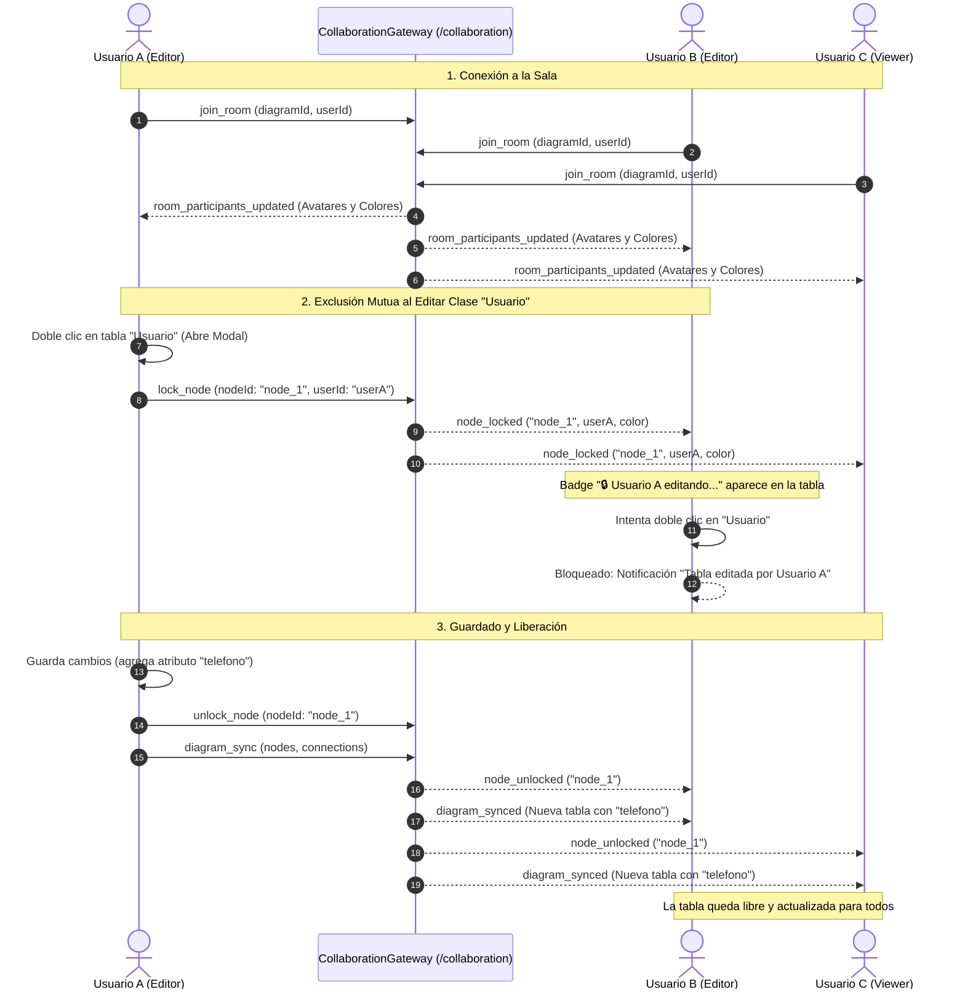

# 📡 Módulo de Colaboración en Tiempo Real (WebSockets, Sincronización & Exclusión Mutua)

## 📌 Descripción General
El módulo de colaboración gestiona las sesiones concurrentes de modelado UML en tiempo real sobre el mismo diagrama, ofreciendo:
1. **Presencia y cursores en vivo:** Transmisión de coordenadas del cursor `(x, y)` con nombres y colores diferenciados para cada colaborador.
2. **Sincronización reactiva del lienzo:** Propagación multicanal inmediata de mutaciones sobre nodos, atributos, métodos y conexiones entre los clientes conectados a la sala.
3. **Exclusión Mutua y Bloqueo de Tablas (Node-Level Locking):** Protocolo de bloqueo exclusivo temporal al abrir el modal de edición de una tabla para prevenir condiciones de carrera y sobreescrituras destructivas.
4. **Control de Acceso por Roles:** Aplicación estricta de permisos en el canvas para `OWNER`, `EDITOR` y `VIEWER` (Modo Espectador / Solo Lectura).
5. **Persistencia de sesiones activas:** Registro en PostgreSQL de sesiones activas (`collaboration_sessions`) y participantes (`session_participants`).

---

## 🏛 Arquitectura en 5 Capas

```
modules/collaboration/
├── entities/
│   ├── collaboration-session.entity.ts # Sesión de sala activa vinculada a un diagrama
│   └── session-participant.entity.ts    # Participante con color de cursor y estado de conexión
├── dtos/
│   ├── join-room.dto.ts                 # DTO para unirse o iniciar sala
│   ├── cursor-position.dto.ts           # DTO para coordenadas del cursor
│   └── session-response.dto.ts          # Respuesta estructurada con participantes
├── repositories/
│   └── session.repository.ts            # Operaciones de persistencia TypeORM
├── services/
│   └── yjs-sync.service.ts              # Lógica de asignación de salas, colores y estados
├── gateways/
│   └── collaboration.gateway.ts         # Gateway WebSocket Socket.io (/collaboration) con mapa de bloqueos
└── controllers/
    └── collaboration.controller.ts      # Endpoints REST para consulta y gestión de sesiones
```

---

## 🔒 Protocolo de Exclusión Mutua (Bloqueo de Nodos)

Para evitar que dos usuarios modifiquen los atributos o métodos de la misma clase al mismo tiempo y se produzcan sobreescrituras ciegas, se implementó un mecanismo de **bloqueo pesimista granular por tabla**:

### 1. Flujo de Adquisición de Bloqueo
1. **Doble Clic:** Cuando el Usuario A hace doble clic sobre la clase `Usuario`, el frontend abre el modal de edición y emite el evento `lock_node` con `{ diagramId, roomCode, nodeId: 'node_1', userId, userName, color }`.
2. **Registro en Gateway:** El `CollaborationGateway` almacena el bloqueo en su mapa en memoria `nodeLocks` bajo la clave `${diagramId}_${nodeId}`.
3. **Difusión `node_locked`:** El servidor emite `node_locked` a todos los demás clientes de la sala.
4. **Estado Visual:** En las pantallas de los demás usuarios (Usuario B, Usuario C):
   - La tabla muestra un badge flotante animado: `🔒 [Usuario A] (editando...)` con el color de Usuario A.
   - La tabla adquiere un contorno (*outline*) con el color del usuario que la está editando.
   - El botón de eliminación (&times;) se deshabilita para proteger la tabla.
   - Si otro usuario hace doble clic, se bloquea la apertura del modal y se muestra un mensaje informativo.

### 2. Flujo de Liberación y Sincronización
1. **Guardar o Cancelar:** Al hacer clic en "Guardar Cambios", "Cancelar" o presionar `Escape`, el frontend del Usuario A emite:
   - `unlock_node`: Para liberar el identificador de la tabla en el servidor.
   - `diagram_sync`: Con los nuevos atributos/métodos actualizados.
2. **Difusión `node_unlocked` y `diagram_synced`:** El servidor remueve el bloqueo de `nodeLocks` y notifica a la sala.
3. **Actualización Automática:** La tabla se desbloquea en todos los clientes y refleja instantáneamente la nueva definición estructural.

### 3. Tolerancia a Fallos y Desconexiones
Si un usuario con una tabla bloqueada cierra la pestaña o pierde conectividad:
- El Gateway detecta `handleDisconnect(socket)`.
- El servidor busca todos los bloqueos asociados al `userId` desconectado en `nodeLocks`.
- Emite automáticamente `node_unlocked` a la sala para cada tabla bloqueada, garantizando que ninguna tabla quede bloqueada permanentemente.

---

## 📊 Diagrama de Secuencia: Co-edición y Exclusión Mutua



---

## 👥 Matriz de Permisos por Rol en Colaboración

| Acción en el Diagrama | OWNER | EDITOR | VIEWER (Espectador) |
|---|:---:|:---:|:---:|
| Ver Diagrama y Cursores en Vivo | ✅ | ✅ | ✅ |
| Recibir Sincronización en Tiempo Real | ✅ | ✅ | ✅ |
| Zoom, Centrar y Navegación | ✅ | ✅ | ✅ |
| Mover Clases y Relaciones | ✅ | ✅ | ❌ (Bloqueado) |
| Doble Clic para Adquirir Bloqueo y Editar | ✅ | ✅ | ❌ (Solo Lectura) |
| Agregar Nuevas Clases desde Toolbox | ✅ | ✅ | ❌ (Deshabilitado) |
| Crear Relaciones UML entre Tablas | ✅ | ✅ | ❌ (Deshabilitado) |
| Eliminar Clases y Conexiones | ✅ | ✅ | ❌ (Deshabilitado) |
| Guardar Cambios en Base de Datos | ✅ | ✅ | ❌ (Oculto) |
| Exportar JSON y XMI 2.1 | ✅ | ✅ | ✅ |

---

## ⚡ Eventos WebSocket (`Namespace: /collaboration`)

| Evento de Entrada | Payload | Evento de Salida Emitido | Descripción |
|---|---|---|---|
| `join_room` | `{ diagramId, roomCode, userId, userName, color }` | `user_joined`, `room_participants_updated` | Une el socket a la sala del diagrama, asigna color y sincroniza avatares y bloqueos activos. |
| `leave_room` | `{ diagramId, roomCode, userId, sessionId }` | `user_left`, `room_participants_updated` | Retira el socket de la sala y actualiza presencia. |
| `lock_node` | `{ diagramId, roomCode, nodeId, userId, userName, color }` | `node_locked`, `node_lock_rejected` | Adquiere exclusión mutua sobre una tabla para edición. |
| `unlock_node` | `{ diagramId, roomCode, nodeId, userId }` | `node_unlocked` | Libera el bloqueo de la tabla permitiendo edición por otros usuarios. |
| `cursor_move` | `{ diagramId, roomCode, userId, userName, x, y, color }` | `cursor_moved` | Transmite en vivo la posición del cursor a ~40 FPS. |
| `node_drag` | `{ diagramId, roomCode, nodeId, position, userId }` | `node_dragged` | Sincroniza el arrastre y coordenadas de las tablas UML. |
| `diagram_sync` | `{ diagramId, roomCode, nodes, connections, userId, action }` | `diagram_synced` | Sincroniza mutaciones estructurales del AST del diagrama. |
| `chat_message` | `{ diagramId, roomCode, userId, userName, message }` | `chat_message_received` | Chat colaborativo instantáneo entre participantes. |

---

## 🔌 Endpoints REST

### 1. `POST /api/collaboration/sessions/join`
* **Descripción:** Inicia una nueva sesión activa o se une a una existente para un diagrama.
* **Seguridad:** Requiere Bearer JWT Token (`JwtAuthGuard`).
* **Request Body (`JoinRoomDto`):**
  ```json
  {
    "diagramId": "4f9d0c2e-7b56-42d3-9f5b-1c5c0a3f81e2",
    "roomCode": "ROOM-FAC123",
    "cursorColor": "#10B981"
  }
  ```
* **Response (200 OK):**
  ```json
  {
    "success": true,
    "data": {
      "id": "8a3e7b1a-9f12-4c2d-98e3-5a7c2d1b0e4f",
      "diagramId": "4f9d0c2e-7b56-42d3-9f5b-1c5c0a3f81e2",
      "roomCode": "ROOM-FAC123",
      "isActive": true,
      "startedAt": "2026-08-28T23:15:00.000Z",
      "participants": [
        {
          "id": "1b2c3d4e-5f6a-7b8c-9d0e-1f2a3b4c5d6e",
          "userId": "d7a8e2b1-3f4c-4e5a-8b9c-0d1e2f3a4b5c",
          "fullName": "Evert Ingeniero",
          "email": "evert@uagrm.edu.bo",
          "cursorColor": "#10B981",
          "isConnected": true,
          "lastSeenAt": "2026-08-28T23:15:00.000Z"
        }
      ]
    }
  }
  ```

### 2. `GET /api/collaboration/sessions/diagram/:diagramId`
* **Descripción:** Obtiene los detalles y participantes de la sesión activa de un diagrama.

### 3. `GET /api/collaboration/sessions/:id`
* **Descripción:** Obtiene los detalles de una sesión por su identificador UUID.

### 4. `DELETE /api/collaboration/sessions/:id`
* **Descripción:** Finaliza y desactiva la sesión de colaboración.

---

## 🧪 Pruebas Unitarias
Se ejecutan mediante `npm test`:
* `yjs-sync.service.spec.ts`: Cobertura de inicio de sala, unión de usuarios, abandono, consulta y cierre.
* `collaboration.controller.spec.ts`: Cobertura de endpoints REST HTTP.
