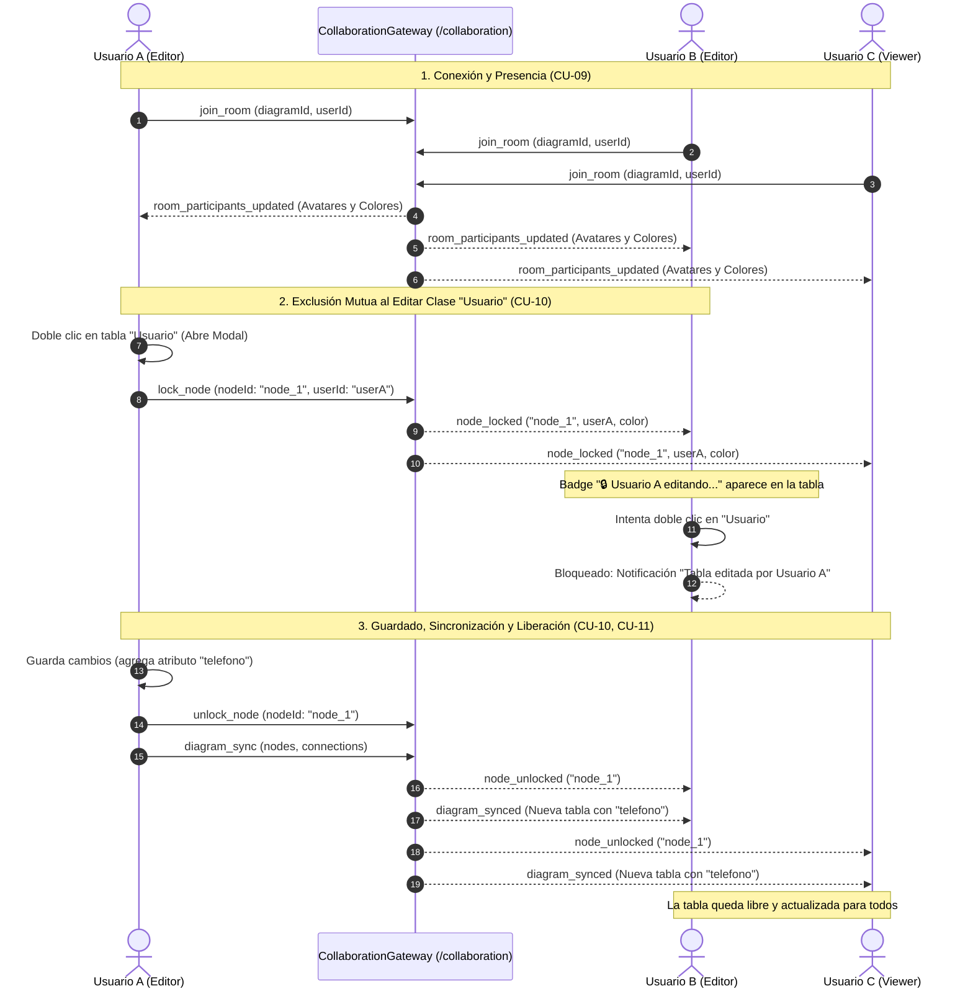

# 📡 Módulo de Colaboración en Tiempo Real (WebSockets, Sincronización & Exclusión Mutua)

## 📌 Descripción General
El **Módulo de Colaboración** gestiona las sesiones concurrentes de modelado UML en tiempo real sobre el mismo diagrama, ofreciendo:
1. **Presencia y cursores en vivo:** Transmisión de coordenadas del cursor `(x, y)` con nombres y colores diferenciados para cada colaborador.
2. **Sincronización reactiva del lienzo:** Propagación multicanal inmediata de mutaciones sobre nodos, atributos, métodos y conexiones entre los clientes conectados a la sala.
3. **Exclusión Mutua y Bloqueo de Tablas (Node-Level Locking):** Protocolo de bloqueo exclusivo temporal al abrir el modal de edición de una tabla para prevenir condiciones de carrera y sobreescrituras destructivas.
4. **Control de Acceso por Roles:** Aplicación estricta de permisos en el canvas para `OWNER`, `EDITOR` y `VIEWER` (Modo Espectador / Solo Lectura).
5. **Persistencia de sesiones activas:** Registro en PostgreSQL de sesiones activas (`collaboration_sessions`) y participantes (`session_participants`).

---

## 🏛 Arquitectura en 5 Capas (Backend)

```
modules/collaboration/
├── entities/
│   ├── collaboration-session.entity.ts # Sesión de sala activa vinculada a un diagrama
│   └── session-participant.entity.ts    # Participante con color de cursor y estado de conexión
├── dtos/
│   ├── join-room.dto.ts                 # DTO para unirse o iniciar sala
│   ├── cursor-position.dto.ts           # DTO para coordenadas del cursor
│   └── session-response.dto.ts          # Respuesta estructurada con participantes
├── repositories/
│   └── session.repository.ts            # Operaciones de persistencia TypeORM
├── services/
│   └── yjs-sync.service.ts              # Lógica de asignación de salas, colores y estados
├── gateways/
│   └── collaboration.gateway.ts         # Gateway WebSocket Socket.io (/collaboration) con mapa de bloqueos
└── controllers/
    └── collaboration.controller.ts      # Endpoints REST para consulta y gestión de sesiones
```

---

## 📋 Casos de Uso del Módulo

### 🔹 CU-09: Presencia y Cursores en Tiempo Real
* **Actor Principal:** Usuario Autenticado (`OWNER`, `EDITOR`, `VIEWER`).
* **Descripción:** Permite a todos los colaboradores en un diagrama visualizar en vivo la presencia de sus compañeros, avatares distintivos en la barra superior y los punteros del ratón en tiempo real.
* **Flujo Principal:**
  1. El usuario ingresa a la vista del diagrama; el cliente emite `join_room` con `{ diagramId, userId, userName, color }`.
  2. El servidor asocia el socket a la sala del diagrama y difunde `room_participants_updated` con los avatares activos.
  3. Cada vez que el usuario mueve el cursor sobre el lienzo, el cliente transmite `cursor_move` (con throttling a ~40 FPS).
  4. Los demás clientes reciben `cursor_moved` y renderizan la flecha SVG con la etiqueta de nombre y color del colaborador.
  5. Al salir de la vista o desconectarse, se emite `user_left` y se limpian los indicadores.

---

### 🔹 CU-10: Exclusión Mutua y Bloqueo de Tablas (Node-Level Locking)
* **Actor Principal:** `OWNER` o `EDITOR`.
* **Descripción:** Garantiza que cuando un usuario entra a editar las propiedades de una tabla UML, esta quede bloqueada para los demás colaboradores hasta que se completen o descarten los cambios, evitando sobreescrituras destructivas.
* **Flujo Principal (Adquisición de Bloqueo):**
  1. El Usuario A hace doble clic sobre la clase `Usuario`.
  2. El frontend abre inmediatamente el modal de edición y emite `lock_node` al servidor.
  3. El servidor registra el bloqueo en `nodeLocks` y difunde `node_locked` a los demás usuarios.
  4. En las pantallas de los demás usuarios (Usuario B, Usuario C):
     - La tabla muestra el badge animado: `🔒 [Usuario A] (editando...)`.
     - La tabla se resalta con un contorno del color del Usuario A.
     - El cursor cambia a `not-allowed` y se deshabilita la eliminación de la tabla.
* **Flujo Principal (Liberación y Sincronización):**
  1. El Usuario A hace clic en "Guardar Cambios" o "Cancelar" (o presiona `Escape`).
  2. El frontend emite `unlock_node` y `diagram_sync` con los atributos actualizados.
  3. El servidor elimina el bloqueo y difunde `node_unlocked` y `diagram_synced` a la sala.
  4. La tabla se desbloquea en todos los clientes reflejando la nueva estructura.
* **Tolerancia a Fallos:** Si el Usuario A cierra el navegador mientras editaba, `handleDisconnect` libera automáticamente todos los bloqueos retenidos.

---

### 🔹 CU-11: Sincronización Reactiva de Diagramas y Co-edición
* **Actor Principal:** `OWNER`, `EDITOR`, `VIEWER`.
* **Descripción:** Mantiene el estado visual y relacional del diagrama sincronizado entre todos los navegadores abiertos y aplica las restricciones del rol `VIEWER`.
* **Flujo Principal:**
  1. Cuando un `OWNER` o `EDITOR` arrastra una clase (`node_drag`), agrega una relación o crea una clase asociativa, el cambio se difunde instantáneamente a todos los clientes.
  2. Los usuarios con rol `VIEWER` (Modo Espectador) observan en vivo todas las mutaciones sin desfase, manteniendo sus controles de creación y guardado bloqueados.

---

## 📊 Diagrama de Secuencia Mermaid: Co-edición y Exclusión Mutua



---

## 👥 Matriz de Permisos por Rol en Colaboración

| Acción en el Diagrama | OWNER | EDITOR | VIEWER (Espectador) |
|---|:---:|:---:|:---:|
| Ver Diagrama y Cursores en Vivo | ✅ | ✅ | ✅ |
| Recibir Sincronización en Tiempo Real | ✅ | ✅ | ✅ |
| Zoom, Centrar y Navegación | ✅ | ✅ | ✅ |
| Mover Clases y Relaciones | ✅ | ✅ | ❌ (Bloqueado) |
| Doble Clic para Adquirir Bloqueo y Editar | ✅ | ✅ | ❌ (Solo Lectura) |
| Agregar Nuevas Clases desde Toolbox | ✅ | ✅ | ❌ (Deshabilitado) |
| Crear Relaciones UML entre Tablas | ✅ | ✅ | ❌ (Deshabilitado) |
| Eliminar Clases y Conexiones | ✅ | ✅ | ❌ (Deshabilitado) |
| Guardar Cambios en Base de Datos | ✅ | ✅ | ❌ (Oculto) |
| Exportar JSON y XMI 2.1 | ✅ | ✅ | ✅ |

---

## ⚡ Eventos WebSocket (`Namespace: /collaboration`)

| Evento de Entrada | Payload | Evento de Salida Emitido | Descripción |
|---|---|---|---|
| `join_room` | `{ diagramId, roomCode, userId, userName, color }` | `user_joined`, `room_participants_updated` | Une el socket a la sala del diagrama, asigna color y sincroniza avatares y bloqueos activos. |
| `leave_room` | `{ diagramId, roomCode, userId, sessionId }` | `user_left`, `room_participants_updated` | Retira el socket de la sala y actualiza presencia. |
| `lock_node` | `{ diagramId, roomCode, nodeId, userId, userName, color }` | `node_locked`, `node_lock_rejected` | Adquiere exclusión mutua sobre una tabla para edición. |
| `unlock_node` | `{ diagramId, roomCode, nodeId, userId }` | `node_unlocked` | Libera el bloqueo de la tabla permitiendo edición por otros usuarios. |
| `cursor_move` | `{ diagramId, roomCode, userId, userName, x, y, color }` | `cursor_moved` | Transmite en vivo la posición del cursor a ~40 FPS. |
| `node_drag` | `{ diagramId, roomCode, nodeId, position, userId }` | `node_dragged` | Sincroniza el arrastre y coordenadas de las tablas UML. |
| `diagram_sync` | `{ diagramId, roomCode, nodes, connections, userId, action }` | `diagram_synced` | Sincroniza mutaciones estructurales del AST del diagrama. |
| `chat_message` | `{ diagramId, roomCode, userId, userName, message }` | `chat_message_received` | Chat colaborativo instantáneo entre participantes. |

---

## 🔌 Endpoints REST

### 1. `POST /api/collaboration/sessions/join`
* **Descripción:** Inicia una nueva sesión activa o se une a una existente para un diagrama.
* **Seguridad:** Requiere Bearer JWT Token (`JwtAuthGuard`).

### 2. `GET /api/collaboration/sessions/diagram/:diagramId`
* **Descripción:** Obtiene los detalles y participantes de la sesión activa de un diagrama.

### 3. `GET /api/collaboration/sessions/:id`
* **Descripción:** Obtiene los detalles de una sesión por su identificador UUID.

### 4. `DELETE /api/collaboration/sessions/:id`
* **Descripción:** Finaliza y desactiva la sesión de colaboración.

---

## 🧪 Pruebas Unitarias
Se ejecutan mediante `npm test`:
* `yjs-sync.service.spec.ts`: Cobertura de inicio de sala, unión de usuarios, abandono, consulta y cierre.
* `collaboration.controller.spec.ts`: Cobertura de endpoints REST HTTP.
