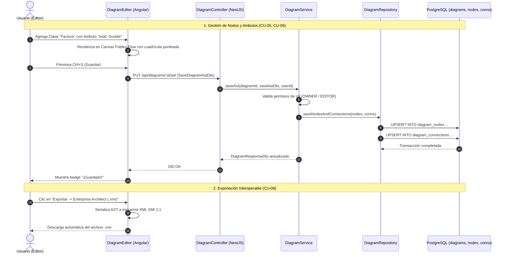

# 📊 Módulo de Modelado y Persistencia de Diagramas UML (Diagrams Module)

## 📌 Descripción General
El **Módulo de Diagramas** proporciona el motor de modelado visual y persistencia relacional para el Árbol de Sintaxis Abstracta (**AST**) de diagramas de clases UML 2.5 mediante **Foblex Flow**. Soporta edición in-situ, tipos de datos fuertemente validados para generación backend, cálculo de puntos medios para clases de asociación e interoperabilidad estándar con **Enterprise Architect (XMI 2.1)** y **JSON**.

---

## 🏛 Arquitectura en 5 Capas (Backend)

```
src/modules/diagrams/
├── controllers/          # [Capa 1] Controladores REST & Swagger (DiagramController)
├── services/             # [Capa 2] Lógica de AST, Normalización y Validación (DiagramService)
├── repositories/         # [Capa 3] Acceso a Datos TypeORM (DiagramRepository, DiagramNodeRepository, DiagramConnectionRepository)
├── entities/             # [Capa 4] Esquema Relacional ('diagrams', 'diagram_nodes', 'diagram_connections')
└── dtos/                 # [Capa 5] DTOs de Persistencia del AST con Validation Pipes
```

---

## 📐 Especificación de Relaciones UML 2.5 y Marcadores

| Tipo de Relación | Símbolo Gráfico | Representación UML | Marcador Origen | Marcador Destino | Estilo de Línea |
| :--- | :---: | :--- | :---: | :---: | :---: |
| **Association** | `───` | Asociación estructural simple | Ninguno | Ninguno | Sólida |
| **Generalization** | `─▷` | Herencia (Subclase $\rightarrow$ Superclase) | Ninguno | Triángulo Blanco Cerrado | Sólida |
| **Realization** | `┈▷` | Implementación de Interfaz | Ninguno | Triángulo Blanco Cerrado | Discontinua (`6 4`) |
| **Composition** | `◆──` | Pertenencia fuerte (Ciclo de vida acoplado) | Rombo Negro Relleno | Ninguno | Sólida |
| **Aggregation** | `◇──` | Pertenencia débil (Contenedor independiente) | Rombo Blanco Hueco | Ninguno | Sólida |
| **Dependency** | `┈>` | Uso temporal o parámetro de método | Ninguno | Flecha Abierta | Discontinua (`6 4`) |
| **Association Class** | `─*─┄[C]` | Relación N:M con tabla intermedia | Ninguno | Punto Medio Ancla | Discontinua a Tabla |

---

## 📋 Casos de Uso del Módulo

### 🔹 CU-04: Gestión de Clases y Estructura Interna (Atributos y Métodos)
* **Actor Principal:** `A1, A2` (Ingeniero Anfitrión / Ingeniero Colaborador).
* **Prioridad:** `ALTA`
* **Descripción:** Permite la creación visual, posicionamiento $(X, Y)$, redimensionamiento y eliminación de clases sobre el lienzo punteado, junto con la edición in-situ de atributos tipados fuertemente para backend/SQL y métodos con parámetros y tipos de retorno.
* **Flujo Principal (Creación, Posicionamiento y Redimensionamiento):**
  1. El usuario hace clic en el botón `+ Nueva Clase UML` del Toolbox.
  2. El sistema genera una nueva entidad en el canvas con coordenadas calculadas para evitar superposiciones.
  3. El usuario puede arrastrar libremente la caja de clase por el lienzo; las coordenadas se sincronizan en tiempo real mediante `node_drag`.
  4. Mediante la manija inferior derecha `◢`, el usuario ajusta el ancho y alto mínimo de la tabla.
* **Flujo Principal (Edición de Atributos y Métodos):**
  1. El usuario hace doble clic sobre la clase UML para abrir el modal de propiedades (adquiriendo el bloqueo de exclusión mutua `lock_node`).
  2. **Atributos (-):** Agrega atributos seleccionando tipos predefinidos: `UUID`, `String`, `Integer`, `Long`, `Boolean`, `Double`, `Float`, `BigDecimal`, `LocalDate`, `LocalDateTime`, `Date`, `Text`, `byte[]`.
  3. **Métodos (+):** Agrega operaciones especificando nombre, parámetros tipados y selector de tipo de retorno.
  4. Al hacer clic en "Guardar Cambios", se actualiza la estructura visual en el canvas, se libera el bloqueo (`unlock_node`) y se sincroniza con los colaboradores.
* **Flujo Principal (Eliminación de Clase):**
  1. El usuario hace clic en el botón de cierre (&times;) de la cabecera de la clase.
  2. El sistema remueve la clase y elimina en cascada todas las conexiones entrantes y salientes vinculadas a ella.

---

### 🔹 CU-05: Gestión de Relaciones y Conectores UML
* **Actor Principal:** `A1, A2` (Ingeniero Anfitrión / Ingeniero Colaborador).
* **Prioridad:** `ALTA`
* **Descripción:** Permite establecer conexiones semánticas UML 2.5 entre clases (Asociación, Generalización con triángulo blanco, Realización discontinua, Composición con rombo negro, Agregación con rombo blanco, Dependencia) y la creación geométrica de Clases de Asociación N:M con cálculo de ancla medio.
* **Flujo Principal (Relaciones Estándar):**
  1. El usuario selecciona el tipo de relación en el Toolbox (ej. *Composición*).
  2. Hace clic en la `Tabla Origen`; una línea guía interactiva sigue el puntero del mouse en tiempo real.
  3. Hace clic en la `Tabla Destino`; el sistema calcula los puntos de conexión óptimos (`_top`, `_right`, `_bottom`, `_left`) y traza la línea con sus multiplicidades y marcadores gráficos.
  4. Mediante doble clic en la línea, el usuario puede modificar las multiplicidades (`1`, `0..1`, `1..*`, `0..*`, `*`) o cambiar el estilo de enrutamiento (*Ortogonal*, *Directa*, *Bezier*, *Adaptativa*).
* **Flujo Principal (Clases de Asociación N:M):**
  1. El usuario selecciona `Association Class` y enlaza dos clases (ej. `Estudiante` y `Materia`).
  2. El sistema calcula el punto medio $(\frac{x_1 + x_2}{2}, \frac{y_1 + y_2}{2})$ e inserta un nodo ancla invisible.
  3. Traza la relación principal de muchos a muchos y conecta la clase intermedia asociativa con una línea discontinua perpendicular al ancla.

---

### 🔹 CU-08: Exportación e Importación Interoperable
* **Actor Principal:** `A1, A2` (Ingeniero Anfitrión / Ingeniero Colaborador).
* **Prioridad:** `BAJA`
* **Descripción:** Permite la persistencia del Árbol de Sintaxis Abstracta (AST) en PostgreSQL (`Ctrl+S`), la descarga del archivo de definición en formato JSON y la importación de archivos JSON externos para restaurar o transferir diagramas.
* **Flujo Principal:**
  1. El usuario despliega el menú `Exportar ▾`.
  2. **Descargar AST (.json):** Genera el archivo JSON completo estructurado con las clases, atributos, métodos, posiciones y conexiones.
  3. **Ver JSON en Pantalla:** Despliega el visor de AST en pantalla con resaltado de sintaxis.
  4. **Importar Archivo .json:** Permite cargar un archivo JSON externo que reemplaza o fusiona el estado actual y se renderiza en el canvas.

---

## 📊 Diagrama de Secuencia Mermaid: Ciclo de Vida del AST UML



---

## 🧪 Casos de Prueba (Test Cases)

| ID Caso de Prueba | Caso de Uso | Descripción / Escenario | Precondiciones | Datos de Entrada | Pasos de Ejecución | Resultado Esperado | Resultado Real | Estado |
|---|---|---|---|---|---|---|---|:---:|
| **TC_CU05_01** | CU-05 | Creación y posicionamiento de nueva clase UML (Camino feliz) | Editor abierto con permisos de OWNER/EDITOR | Clic en botón `+ Nueva Clase UML` | 1. Clic en "+ Nueva Clase UML".<br>2. Arrastrar tabla a posición (x: 250, y: 180). | Nueva caja de clase creada con ID único, renderizada y posicionada en el lienzo. | Nodo agregado al signal `nodes`, posición reflejada en el canvas. | **Aprobado (Pass)** |
| **TC_CU05_02** | CU-05 | Redimensionamiento interactivo de tabla (Camino feliz) | Clase UML visible en el lienzo | Drag en manija `◢` (dx: +60px, dy: +40px) | 1. Mantener presionado en esquina inferior derecha.<br>2. Arrastrar mouse y soltar. | El ancho y alto de la tabla se recalculan manteniendo legibilidad de los textos. | Dimensiones `width` y `height` actualizadas; conectores recalculados. | **Aprobado (Pass)** |
| **TC_CU05_03** | CU-05 | Eliminación de clase con cascada sobre sus conexiones (Camino feliz) | Clase con relaciones activas | `nodeId`: "node_1" | 1. Clic en botón (&times;) de cabecera de la tabla. | Clase eliminada y todas sus conexiones entrantes/salientes purgadas del lienzo. | Clase y conexiones asociadas removidas de `nodes` y `connections`. | **Aprobado (Pass)** |
| **TC_CU06_01** | CU-06 | Adición de atributos con tipos fuertemente validados (Camino feliz) | Clase UML seleccionada en canvas | `name`: "precio_unitario", `type`: "Double" | 1. Doble clic en tabla.<br>2. Clic "+ Agregar Atributo".<br>3. Seleccionar tipo "Double".<br>4. Guardar cambios. | Atributo agregado a la tabla con formato `- precio_unitario: Double`. | Atributo renderizado en compartimento superior con tipado estricto. | **Aprobado (Pass)** |
| **TC_CU06_02** | CU-06 | Adición de métodos con parámetros y tipo de retorno (Camino feliz) | Modal de edición de clase abierto | `name`: "calcularTotal", `parameters`: "descuento: Double", `returnType`: "Double" | 1. Clic "+ Agregar Operación".<br>2. Llenar campos.<br>3. Guardar cambios. | Método renderizado en compartimento inferior con formato `+ calcularTotal(descuento: Double): Double`. | Operación guardada y reflejada correctamente en el modelo. | **Aprobado (Pass)** |
| **TC_CU06_03** | CU-06 | Modificación del nombre de la clase (Camino feliz) | Modal de edición de clase abierto | `name`: "FacturaDetalle" | 1. Cambiar texto del nombre.<br>2. Clic "Guardar Cambios". | Cabecera de la tabla actualizada con el nuevo nombre en mayúsculas/PascalCase. | Nombre actualizado en canvas y en sincronización con backend. | **Aprobado (Pass)** |
| **TC_CU07_01** | CU-07 | Creación de relación de Composición con marcadores (Camino feliz) | Dos clases disponibles en canvas | Herramienta `Composition`, Origen: `Pedido`, Destino: `DetallePedido` | 1. Seleccionar "Composition".<br>2. Clic en Pedido.<br>3. Clic en DetallePedido. | Conexión trazada con Rombo Negro Relleno en Pedido y multiplicidad `1` a `1..*`. | Conexión insertada con estilo ortogonal y marcadores UML 2.5. | **Aprobado (Pass)** |
| **TC_CU07_02** | CU-07 | Edición de multiplicidades y enrutamiento Bezier (Camino feliz) | Relación existente en canvas | `sourceMult`: "0..1", `targetMult`: "*", `lineStyle`: "bezier" | 1. Doble clic en relación.<br>2. Cambiar a curva Bezier.<br>3. Ajustar multiplicidades.<br>4. Aceptar. | La relación cambia a trazado curvo suave y actualiza sus etiquetas numéricas. | Conexión recalculada con enrutamiento Bezier y multiplicidades actualizadas. | **Aprobado (Pass)** |
| **TC_CU07_03** | CU-07 | Creación de Clase de Asociación con nodo ancla (Camino feliz) | Dos clases independientes en canvas | Herramienta `Association Class`, Origen: `Estudiante`, Destino: `Materia` | 1. Seleccionar "Association Class".<br>2. Clic en Estudiante y luego en Materia. | Se genera relación N:M, nodo ancla invisible en punto medio y clase asociativa `EstudianteMateria`. | Estructura asociativa completa generada con línea discontinua al punto medio. | **Aprobado (Pass)** |
| **TC_CU08_01** | CU-08 | Exportación del AST a archivo JSON (Camino feliz) | Diagrama con clases y relaciones en pantalla | Clic en `Exportar ▾ -> Descargar AST (.json)` | 1. Abrir menú Exportar.<br>2. Clic en "Descargar AST (.json)". | Descarga archivo `.json` con estructura completa del AST validada. | Archivo descargado con versión, nodos, atributos, métodos y conexiones. | **Aprobado (Pass)** |
| **TC_CU08_02** | CU-08 | Exportación estándar XMI 2.1 compatible con Enterprise Architect (Camino feliz) | Diagrama activo | Clic en `Exportar ▾ -> Enterprise Architect (.xmi)` | 1. Abrir menú Exportar.<br>2. Clic en "Enterprise Architect (.xmi)". | Descarga archivo `.xmi` con formato XML estándar OMG UML 2.1. | Archivo `.xmi` generado con `<packagedElement>` y `<ownedAttribute>`. | **Aprobado (Pass)** |
| **TC_CU08_03** | CU-08 | Importación de archivo JSON válido (Camino feliz) | Archivo JSON de diagrama previo | Archivo `diagrama_backup.json` | 1. Clic "Importar Archivo .json".<br>2. Seleccionar archivo local. | El lienzo se limpia y se reconstruye fielmente con los nodos y conexiones del archivo. | Diagrama cargado, validado y renderizado exitosamente. | **Aprobado (Pass)** |

---

## 🔌 Especificación de Endpoints REST

| Método | Ruta | Seguridad | Roles Permitidos | Descripción |
| :--- | :--- | :---: | :---: | :--- |
| `GET` | `/api/diagrams/:id` | Bearer JWT | Todos | Obtiene el AST completo del diagrama con nodos y conexiones |
| `GET` | `/api/diagrams/project/:projectId` | Bearer JWT | Todos | Lista todos los diagramas pertenecientes a un proyecto |
| `POST` | `/api/diagrams` | Bearer JWT | `OWNER`, `EDITOR` | Crea un nuevo diagrama de clases en un proyecto |
| `PUT` | `/api/diagrams/:id` | Bearer JWT | `OWNER`, `EDITOR` | Actualiza metadatos básicos del diagrama (nombre, descripción) |
| `PUT` | `/api/diagrams/:id/ast` | Bearer JWT | `OWNER`, `EDITOR` | Persiste de forma transaccional el AST completo del diagrama |
| `DELETE` | `/api/diagrams/:id` | Bearer JWT | `OWNER` | Elimina el diagrama y sus elementos visuales |

---

## 📦 Data Transfer Objects (DTOs)

### `SaveDiagramAstDto`
```typescript
export class SaveDiagramAstDto {
  @ApiProperty({ enum: ['segment', 'straight', 'bezier', 'adaptive-curve'], default: 'segment' })
  @IsEnum(['segment', 'straight', 'bezier', 'adaptive-curve'])
  defaultLineStyle: string;

  @ApiProperty({ type: [UmlClassNodeDto] })
  @IsArray()
  @ValidateNested({ each: true })
  @Type(() => UmlClassNodeDto)
  nodes: UmlClassNodeDto[];

  @ApiProperty({ type: [UmlConnectionDto] })
  @IsArray()
  @ValidateNested({ each: true })
  @Type(() => UmlConnectionDto)
  connections: UmlConnectionDto[];
}
```
