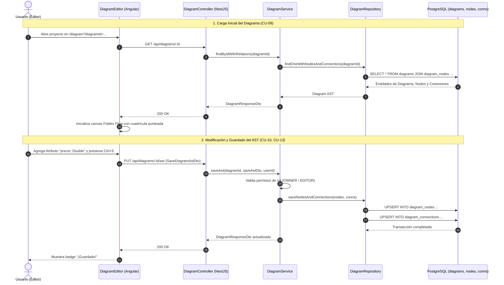

# 📊 Módulo de Modelado y Persistencia de Diagramas UML (Diagrams Module)

## 📌 Descripción General
El **Módulo de Diagramas** proporciona el motor de persistencia relacional para el Árbol de Sintaxis Abstracta (**AST**) de diagramas de clases UML 2.5 y el lienzo visual interactivo en Angular mediante **Foblex Flow**. Soporta edición in-situ, tipos de datos fuertemente validados para generación backend, cálculo de puntos medios para clases de asociación e interoperabilidad estándar con **Enterprise Architect (XMI 2.1)** y **JSON**.

---

## 🏛 Arquitectura en 5 Capas (Backend)

```
src/modules/diagrams/
├── controllers/          # [Capa 1] Controladores REST & Swagger (DiagramController)
├── services/             # [Capa 2] Lógica de AST, Normalización y Validación (DiagramService)
├── repositories/         # [Capa 3] Acceso a Datos TypeORM (DiagramRepository, DiagramNodeRepository, DiagramConnectionRepository)
├── entities/             # [Capa 4] Esquema Relacional ('diagrams', 'diagram_nodes', 'diagram_connections')
└── dtos/                 # [Capa 5] DTOs de Persistencia del AST con Validation Pipes
```

---

## 📐 Especificación de Relaciones UML 2.5 y Marcadores

| Tipo de Relación | Símbolo Gráfico | Representación UML | Marcador Origen | Marcador Destino | Estilo de Línea |
| :--- | :---: | :--- | :---: | :---: | :---: |
| **Association** | `───` | Asociación estructural simple | Ninguno | Ninguno | Sólida |
| **Generalization** | `─▷` | Herencia (Subclase $\rightarrow$ Superclase) | Ninguno | Triángulo Blanco Cerrado | Sólida |
| **Realization** | `┈▷` | Implementación de Interfaz | Ninguno | Triángulo Blanco Cerrado | Discontinua (`6 4`) |
| **Composition** | `◆──` | Pertenencia fuerte (Ciclo de vida acoplado) | Rombo Negro Relleno | Ninguno | Sólida |
| **Aggregation** | `◇──` | Pertenencia débil (Contenedor independiente) | Rombo Blanco Hueco | Ninguno | Sólida |
| **Dependency** | `┈>` | Uso temporal o parámetro de método | Ninguno | Flecha Abierta | Discontinua (`6 4`) |
| **Association Class** | `─*─┄[C]` | Relación N:M con tabla intermedia | Ninguno | Punto Medio Ancla | Discontinua a Tabla |

---

## 📋 Casos de Uso del Módulo

### 🔹 CU-09: Carga y Renderizado del Diagrama AST
* **Actor Principal:** Usuario con rol `OWNER`, `EDITOR` o `VIEWER`.
* **Flujo Principal:**
  1. El usuario abre un proyecto y navega a `/diagram?diagramId=...`.
  2. El frontend ejecuta `GET /api/diagrams/:id`.
  3. `DiagramService` carga el registro del diagrama junto a sus nodos (`diagram_nodes`), atributos, métodos y conexiones (`diagram_connections`).
  4. El frontend transforma los registros en signals de Angular (`nodes`, `connections`) y renderiza las cajas de clases sobre el lienzo punteado Foblex Flow.
  5. Se calculan dinámicamente los conectores geométricos óptimos (`_top`, `_bottom`, `_left`, `_right`) según las posiciones $(X, Y)$ de las tablas.

---

### 🔹 CU-10: Edición Tipada de Clases y Métodos
* **Actor Principal:** `OWNER` o `EDITOR`.
* **Flujo Principal:**
  1. El usuario hace doble clic sobre una clase UML.
  2. Se adquiere el bloqueo de exclusión mutua (`lock_node`) y se despliega el modal de edición.
  3. El usuario define el nombre de la clase y gestiona sus atributos seleccionando tipos compatibles con Spring Boot / SQL:
     - `UUID`, `String`, `Integer`, `Long`, `Boolean`, `Double`, `Float`, `BigDecimal`, `LocalDate`, `LocalDateTime`, `Date`, `Text`, `byte[]`.
  4. Define métodos indicando visibilidad (`+`), parámetros tipados y tipo de retorno predefinido.
  5. Al hacer clic en "Guardar Cambios", se actualiza el nodo en el canvas, se libera el bloqueo (`unlock_node`) y se sincroniza en caliente con los colaboradores.

---

### 🔹 CU-11: Creación de Relaciones con Líneas Guía en Tiempo Real
* **Actor Principal:** `OWNER` o `EDITOR`.
* **Flujo Principal:**
  1. El usuario selecciona una herramienta de relación en el Toolbox lateral (ej. *Composition*).
  2. Hace clic en la Tabla Origen (ej. `Pedido`). Aparece una línea guía interactiva en tiempo real siguiendo el cursor del mouse.
  3. Hace clic en la Tabla Destino (ej. `DetallePedido`).
  4. El sistema calcula las caras de conexión más cercanas y genera la conexión con multiplicidad por defecto (`1` a `1..*`) y su respectivo marcador visual (Rombo Negro en el origen).
  5. El AST se actualiza y se sincroniza con los demás usuarios mediante WebSockets.

---

### 🔹 CU-12: Creación de Clases de Asociación (N:M con Tabla Intermedia)
* **Actor Principal:** `OWNER` o `EDITOR`.
* **Flujo Principal:**
  1. El usuario selecciona la herramienta `Association Class` en el Toolbox.
  2. Selecciona `Tabla A` (ej. `Estudiante`) y `Tabla B` (ej. `Materia`).
  3. El sistema calcula el punto medio $(\frac{x_1 + x_2}{2}, \frac{y_1 + y_2}{2})$ entre ambas tablas e inserta un nodo ancla invisible (`isAnchor: true`).
  4. Genera la conexión principal de muchos a muchos (`*` a `*`) y crea automáticamente la clase asociativa intermedia (ej. `EstudianteMateria`) con una línea discontinua enlazada al nodo ancla.

---

### 🔹 CU-13: Persistencia del AST en Base de Datos
* **Actor Principal:** `OWNER` o `EDITOR`.
* **Flujo Principal:**
  1. El usuario hace clic en el botón `Guardar` o presiona el atajo `Ctrl + S`.
  2. El frontend serializa el estado visual completo en un payload `SaveDiagramAstRequest`.
  3. Se envía `PUT /api/diagrams/:id/ast`.
  4. `DiagramService` sincroniza de forma transaccional:
     - Actualiza metadatos del diagrama (`defaultLineStyle`, `updatedAt`).
     - Actualiza coordenadas $(X, Y)$, dimensiones (`width`, `height`), atributos y métodos JSON de cada nodo.
     - Persiste las conexiones relacionales (`sourceId`, `targetId`, multiplicidades, etiquetas y estilos de enrutamiento).
  5. Se responde con `200 OK` y se muestra un feedback visual `¡Guardado!` en el botón.

---

### 🔹 CU-14: Exportación e Importación Interoperable (JSON & XMI 2.1)
* **Actor Principal:** Usuario Autenticado.
* **Flujo Principal:**
  1. El usuario abre el menú desplegable `Exportar ▾`.
  2. Puede descargar el modelo como **JSON AST** para respaldo directo o como **XMI 2.1 (`.xmi`)** estándar compatible con Enterprise Architect.
  3. Mediante la opción `Importar Archivo .json`, puede cargar un diagrama externo, el cual se parsea, valida y renderiza en el canvas.

---

## 📊 Diagrama de Secuencia Mermaid: Ciclo de Vida del AST UML



---

## 🔌 Especificación de Endpoints REST

| Método | Ruta | Seguridad | Roles Permitidos | Descripción |
| :--- | :--- | :---: | :---: | :--- |
| `GET` | `/api/diagrams/:id` | Bearer JWT | Todos | Obtiene el AST completo del diagrama con nodos y conexiones |
| `GET` | `/api/diagrams/project/:projectId` | Bearer JWT | Todos | Lista todos los diagramas pertenecientes a un proyecto |
| `POST` | `/api/diagrams` | Bearer JWT | `OWNER`, `EDITOR` | Crea un nuevo diagrama de clases en un proyecto |
| `PUT` | `/api/diagrams/:id` | Bearer JWT | `OWNER`, `EDITOR` | Actualiza metadatos básicos del diagrama (nombre, descripción) |
| `PUT` | `/api/diagrams/:id/ast` | Bearer JWT | `OWNER`, `EDITOR` | Persiste de forma transaccional el AST completo del diagrama |
| `DELETE` | `/api/diagrams/:id` | Bearer JWT | `OWNER` | Elimina el diagrama y sus elementos visuales |

---

## 📦 Data Transfer Objects (DTOs)

### `SaveDiagramAstDto`
```typescript
export class SaveDiagramAstDto {
  @ApiProperty({ enum: ['segment', 'straight', 'bezier', 'adaptive-curve'], default: 'segment' })
  @IsEnum(['segment', 'straight', 'bezier', 'adaptive-curve'])
  defaultLineStyle: string;

  @ApiProperty({ type: [UmlClassNodeDto] })
  @IsArray()
  @ValidateNested({ each: true })
  @Type(() => UmlClassNodeDto)
  nodes: UmlClassNodeDto[];

  @ApiProperty({ type: [UmlConnectionDto] })
  @IsArray()
  @ValidateNested({ each: true })
  @Type(() => UmlConnectionDto)
  connections: UmlConnectionDto[];
}
```

---

## 🧪 Pruebas Unitarias
Cobertura ejecutada mediante `npm test` en backend:
* `diagram.service.spec.ts`: Pruebas de persistencia transaccional del AST, carga relacional de nodos y conexiones, cálculo de anclas y validación de tipos de datos.
* `diagram.controller.spec.ts`: Pruebas de endpoints REST HTTP de diagramas y AST.
