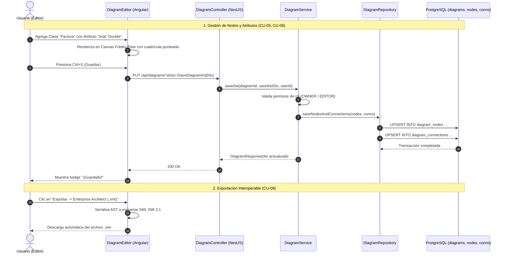

# 📊 Módulo de Modelado y Persistencia de Diagramas UML (Diagrams Module)

## 📌 Descripción General
El **Módulo de Diagramas** proporciona el motor de modelado visual y persistencia relacional para el Árbol de Sintaxis Abstracta (**AST**) de diagramas de clases UML 2.5 mediante **Foblex Flow**. Soporta edición in-situ, tipos de datos fuertemente validados para generación backend, cálculo de puntos medios para clases de asociación e interoperabilidad estándar con **Enterprise Architect (XMI 2.1)** y **JSON**.

---

## 🏛 Arquitectura en 5 Capas (Backend)

```
src/modules/diagrams/
├── controllers/          # [Capa 1] Controladores REST & Swagger (DiagramController)
├── services/             # [Capa 2] Lógica de AST, Normalización y Validación (DiagramService)
├── repositories/         # [Capa 3] Acceso a Datos TypeORM (DiagramRepository, DiagramNodeRepository, DiagramConnectionRepository)
├── entities/             # [Capa 4] Esquema Relacional ('diagrams', 'diagram_nodes', 'diagram_connections')
└── dtos/                 # [Capa 5] DTOs de Persistencia del AST con Validation Pipes
```

---

## 📐 Especificación de Relaciones UML 2.5 y Marcadores

| Tipo de Relación | Símbolo Gráfico | Representación UML | Marcador Origen | Marcador Destino | Estilo de Línea |
| :--- | :---: | :--- | :---: | :---: | :---: |
| **Association** | `───` | Asociación estructural simple | Ninguno | Ninguno | Sólida |
| **Generalization** | `─▷` | Herencia (Subclase $\rightarrow$ Superclase) | Ninguno | Triángulo Blanco Cerrado | Sólida |
| **Realization** | `┈▷` | Implementación de Interfaz | Ninguno | Triángulo Blanco Cerrado | Discontinua (`6 4`) |
| **Composition** | `◆──` | Pertenencia fuerte (Ciclo de vida acoplado) | Rombo Negro Relleno | Ninguno | Sólida |
| **Aggregation** | `◇──` | Pertenencia débil (Contenedor independiente) | Rombo Blanco Hueco | Ninguno | Sólida |
| **Dependency** | `┈>` | Uso temporal o parámetro de método | Ninguno | Flecha Abierta | Discontinua (`6 4`) |
| **Association Class** | `─*─┄[C]` | Relación N:M con tabla intermedia | Ninguno | Punto Medio Ancla | Discontinua a Tabla |

---

## 📋 Casos de Uso del Módulo

### 🔹 CU-04. Gestión de Clases y Estructura Interna (Atributos y Métodos)

| Campo | Detalle |
| :--- | :--- |
| **Nombre de CU** | CU-04. Gestión de Clases y Estructura Interna (Atributos y Métodos) |
| **Propósito** | Crear, posicionar, redimensionar y eliminar cajas de clases UML en el lienzo, y definir su estructura interna de atributos tipados fuertemente y métodos con visibilidad y parámetros. |
| **Actores** | A1 (Ingeniero Anfitrión), A2 (Ingeniero Colaborador con rol EDITOR) |
| **Actor iniciador** | A1 o A2 |
| **Precondición** | Diagrama abierto con rol de edición (`OWNER` o `EDITOR`). La clase a modificar no debe estar bloqueada por otro usuario. |
| **Flujo principal** | **Crear y Posicionar Clase:**<br>• Clic en `+ Nueva Clase UML` en la barra de herramientas.<br>• El sistema inserta un nuevo nodo con ID único y coordenadas $(X, Y)$ evitando solapamientos.<br>• El usuario puede arrastrar libremente la clase por el lienzo; las coordenadas se transmiten en vivo a los colaboradores.<br><br>**Redimensionar Clase:**<br>• Arrastrar la manija inferior derecha `◢` de la clase para ajustar ancho y alto según el contenido.<br><br>**Editar Atributos y Métodos:**<br>• Doble clic sobre la clase (adquiere bloqueo exclusivo `lock_node`).<br>• En el modal, modificar nombre de la clase (PascalCase).<br>• **Atributos (-):** Agregar nombre y tipo estricto (`UUID`, `String`, `Integer`, `Long`, `Boolean`, `Double`, `LocalDate`, `Text`, etc.).<br>• **Métodos (+):** Agregar nombre, parámetros tipados y selector de tipo de retorno.<br>• Guardar cambios: se actualiza el canvas, se libera el bloqueo (`unlock_node`) y se sincroniza con el backend.<br><br>**Eliminar Clase:**<br>• Clic en botón (&times;) de cabecera; se elimina la clase y en cascada todas sus relaciones asociadas. |
| **Postcondición** | Estructura de la clase actualizada en el AST del diagrama y sincronizada en tiempo real. |
| **Excepción** | • **Nodo Bloqueado:** Notificación de que otro usuario está editando la tabla.<br>• **Modo Solo Lectura:** Acciones de modificación deshabilitadas para usuarios `VIEWER`. |

---

### 🔹 CU-05. Gestión de Relaciones y Conectores UML

| Campo | Detalle |
| :--- | :--- |
| **Nombre de CU** | CU-05. Gestión de Relaciones y Conectores UML |
| **Propósito** | Establecer y configurar relaciones semánticas UML 2.5 entre clases (Asociación, Generalización, Realización, Composición, Agregación, Dependencia) y trazar Clases de Asociación N:M con cálculo de punto medio. |
| **Actores** | A1 (Ingeniero Anfitrión), A2 (Ingeniero Colaborador con rol EDITOR) |
| **Actor iniciador** | A1 o A2 |
| **Precondición** | Al menos dos clases creadas en el lienzo; permisos de edición activos. |
| **Flujo principal** | **Crear Relación Estándar:**<br>• Seleccionar herramienta en el Toolbox (Asociación, Generalización, Realización, Composición, Agregación, Dependencia).<br>• Clic en la clase de origen y clic en la clase de destino.<br>• El sistema calcula los puertos de anclaje óptimos (`_top`, `_right`, `_bottom`, `_left`) y traza la conexión con sus marcadores gráficos oficiales.<br><br>**Configurar Multiplicidades y Enrutamiento:**<br>• Doble clic sobre la línea de conexión.<br>• Configurar multiplicidades de origen y destino (`1`, `0..1`, `1..*`, `0..*`, `*`) y rol textual.<br>• Seleccionar estilo de línea (*Ortogonal*, *Directa*, *Bezier*, *Adaptativa*).<br><br>**Crear Clase de Asociación N:M:**<br>• Seleccionar `Association Class` y conectar dos clases base (ej. `Estudiante` y `Materia`).<br>• El sistema inserta un nodo ancla invisible en el punto medio geométrico $(\frac{x_1+x_2}{2}, \frac{y_1+y_2}{2})$ y genera la clase intermedia conectada con línea discontinua.<br><br>**Eliminar Conector:**<br>• Seleccionar la conexión y presionar tecla `Supr` / `Delete` o botón de eliminar. |
| **Postcondición** | Conexión semántica registrada en el AST y renderizada en todos los clientes. |
| **Excepción** | • **Auto-conexión Inválida:** Conexiones no permitidas según reglas UML se cancelan con feedback visual. |

---

### 🔹 CU-08. Exportación e Importación Interoperable

| Campo | Detalle |
| :--- | :--- |
| **Nombre de CU** | CU-08. Exportación e Importación Interoperable |
| **Propósito** | Permitir la persistencia transaccional del Árbol de Sintaxis Abstracta (AST) en PostgreSQL (`Ctrl+S`), la descarga del archivo de definición en formato JSON y la carga de diagramas desde archivos JSON externos. |
| **Actores** | A1 (Ingeniero Anfitrión), A2 (Ingeniero Colaborador) |
| **Actor iniciador** | A1 o A2 |
| **Precondición** | Diagrama abierto en el editor con elementos UML en el lienzo. |
| **Flujo principal** | **Guardar AST en Base de Datos:**<br>• El usuario presiona `Ctrl+S` o clic en botón "Guardar".<br>• El frontend envía `PUT /api/diagrams/:id/ast` con todos los nodos, atributos, métodos y conexiones.<br>• El backend valida y almacena el estado completo en PostgreSQL respondiendo HTTP `200 OK`.<br><br>**Exportar AST JSON:**<br>• Desplegar menú `Exportar ▾` $\rightarrow$ `Descargar AST (.json)`.<br>• El sistema genera y descarga automáticamente el archivo `${diagram_name}.json`.<br><br>**Visualizar JSON en Pantalla:**<br>• Clic en `Ver JSON AST` para inspeccionar el modelo en un modal con resaltado de sintaxis.<br><br>**Importar Archivo JSON:**<br>• Clic en `Importar ▾ -> Cargar Archivo .json`.<br>• Seleccionar archivo local; el sistema valida el esquema, limpia el lienzo y renderiza el nuevo modelo. |
| **Postcondición** | Modelo AST persistido en base de datos o exportado/importado exitosamente en JSON. |
| **Excepción** | • **Archivo JSON Corrupto:** Muestra alerta de error de validación de estructura sin alterar el lienzo actual. |

---

## 📊 Diagrama de Secuencia Mermaid: Ciclo de Vida del AST UML



---

## 🧪 Casos de Prueba (Test Cases)

| ID Caso de Prueba | Caso de Uso | Descripción / Escenario | Precondiciones | Datos de Entrada | Pasos de Ejecución | Resultado Esperado | Resultado Real | Estado |
|---|---|---|---|---|---|---|---|:---:|
| **TC_CU04_01** | CU-04 | Creación y posicionamiento de nueva clase UML (Camino feliz) | Editor abierto con permisos de OWNER/EDITOR | Clic en botón `+ Nueva Clase UML` | 1. Clic en "+ Nueva Clase UML".<br>2. Arrastrar tabla a posición (x: 250, y: 180). | Nueva caja de clase creada con ID único, renderizada y posicionada en el lienzo. | Nodo agregado al signal `nodes`, posición reflejada en el canvas. | **Aprobado (Pass)** |
| **TC_CU04_02** | CU-04 | Redimensionamiento interactivo de tabla (Camino feliz) | Clase UML visible en el lienzo | Drag en manija `◢` (dx: +60px, dy: +40px) | 1. Mantener presionado en esquina inferior derecha.<br>2. Arrastrar mouse y soltar. | El ancho y alto de la tabla se recalculan manteniendo legibilidad de los textos. | Dimensiones `width` y `height` actualizadas; conectores recalculados. | **Aprobado (Pass)** |
| **TC_CU04_03** | CU-04 | Adición de atributos con tipos fuertemente validados (Camino feliz) | Clase UML seleccionada en canvas | `name`: "precio_unitario", `type`: "Double" | 1. Doble clic en tabla.<br>2. Clic "+ Agregar Atributo".<br>3. Seleccionar tipo "Double".<br>4. Guardar cambios. | Atributo agregado a la tabla con formato `- precio_unitario: Double`. | Atributo renderizado en compartimento superior con tipado estricto. | **Aprobado (Pass)** |
| **TC_CU04_04** | CU-04 | Adición de métodos con parámetros y tipo de retorno (Camino feliz) | Modal de edición de clase abierto | `name`: "calcularTotal", `parameters`: "descuento: Double", `returnType`: "Double" | 1. Clic "+ Agregar Operación".<br>2. Llenar campos.<br>3. Guardar cambios. | Método renderizado en compartimento inferior con formato `+ calcularTotal(descuento: Double): Double`. | Operación guardada y reflejada correctamente en el modelo. | **Aprobado (Pass)** |
| **TC_CU04_05** | CU-04 | Modificación del nombre de la clase (Camino feliz) | Modal de edición de clase abierto | `name`: "FacturaDetalle" | 1. Cambiar texto del nombre.<br>2. Clic "Guardar Cambios". | Cabecera de la tabla actualizada con el nuevo nombre en mayúsculas/PascalCase. | Nombre actualizado en canvas y en sincronización con backend. | **Aprobado (Pass)** |
| **TC_CU04_06** | CU-04 | Eliminación de clase con cascada sobre sus conexiones (Camino feliz) | Clase con relaciones activas | `nodeId`: "node_1" | 1. Clic en botón (&times;) de cabecera de la tabla. | Clase eliminada y todas sus conexiones entrantes/salientes purgadas del lienzo. | Clase y conexiones asociadas removidas de `nodes` y `connections`. | **Aprobado (Pass)** |
| **TC_CU05_01** | CU-05 | Creación de relación de Composición con marcadores (Camino feliz) | Dos clases disponibles en canvas | Herramienta `Composition`, Origen: `Pedido`, Destino: `DetallePedido` | 1. Seleccionar "Composition".<br>2. Clic en Pedido.<br>3. Clic en DetallePedido. | Conexión trazada con Rombo Negro Relleno en Pedido y multiplicidad `1` a `1..*`. | Conexión insertada con estilo ortogonal y marcadores UML 2.5. | **Aprobado (Pass)** |
| **TC_CU05_02** | CU-05 | Edición de multiplicidades y enrutamiento Bezier (Camino feliz) | Relación existente en canvas | `sourceMult`: "0..1", `targetMult`: "*", `lineStyle`: "bezier" | 1. Doble clic en relación.<br>2. Cambiar a curva Bezier.<br>3. Ajustar multiplicidades.<br>4. Aceptar. | La relación cambia a trazado curvo suave y actualiza sus etiquetas numéricas. | Conexión recalculada con enrutamiento Bezier y multiplicidades actualizadas. | **Aprobado (Pass)** |
| **TC_CU05_03** | CU-05 | Creación de Clase de Asociación con nodo ancla (Camino feliz) | Dos clases independientes en canvas | Herramienta `Association Class`, Origen: `Estudiante`, Destino: `Materia` | 1. Seleccionar "Association Class".<br>2. Clic en Estudiante y luego en Materia. | Se genera relación N:M, nodo ancla invisible en punto medio y clase asociativa `EstudianteMateria`. | Estructura asociativa completa generada con línea discontinua al punto medio. | **Aprobado (Pass)** |
| **TC_CU08_01** | CU-08 | Exportación del AST a archivo JSON (Camino feliz) | Diagrama con clases y relaciones en pantalla | Clic en `Exportar ▾ -> Descargar AST (.json)` | 1. Abrir menú Exportar.<br>2. Clic en "Descargar AST (.json)". | Descarga archivo `.json` con estructura completa del AST validada. | Archivo descargado con versión, nodos, atributos, métodos y conexiones. | **Aprobado (Pass)** |
| **TC_CU08_02** | CU-08 | Persistencia transaccional del AST con Ctrl+S (Camino feliz) | Diagrama modificado en el lienzo | Petición `PUT /api/diagrams/:id/ast` | 1. Presionar Ctrl+S o clic en "Guardar". | Código HTTP `200 OK`, nodos y conexiones persistidos en PostgreSQL. | AST guardado en base de datos sin pérdida de datos. | **Aprobado (Pass)** |
| **TC_CU08_03** | CU-08 | Importación de archivo JSON válido (Camino feliz) | Archivo JSON de diagrama previo | Archivo `diagrama_backup.json` | 1. Clic "Importar Archivo .json".<br>2. Seleccionar archivo local. | El lienzo se limpia y se reconstruye fielmente con los nodos y conexiones del archivo. | Diagrama cargado, validado y renderizado exitosamente. | **Aprobado (Pass)** |

---

## 🔌 Especificación de Endpoints REST

| Método | Ruta | Seguridad | Roles Permitidos | Descripción |
| :--- | :--- | :---: | :---: | :--- |
| `GET` | `/api/diagrams/:id` | Bearer JWT | Todos | Obtiene el AST completo del diagrama con nodos y conexiones |
| `GET` | `/api/diagrams/project/:projectId` | Bearer JWT | Todos | Lista todos los diagramas pertenecientes a un proyecto |
| `POST` | `/api/diagrams` | Bearer JWT | `OWNER`, `EDITOR` | Crea un nuevo diagrama de clases en un proyecto |
| `PUT` | `/api/diagrams/:id` | Bearer JWT | `OWNER`, `EDITOR` | Actualiza metadatos básicos del diagrama (nombre, descripción) |
| `PUT` | `/api/diagrams/:id/ast` | Bearer JWT | `OWNER`, `EDITOR` | Persiste de forma transaccional el AST completo del diagrama |
| `DELETE` | `/api/diagrams/:id` | Bearer JWT | `OWNER` | Elimina el diagrama y sus elementos visuales |

---

## 📦 Data Transfer Objects (DTOs)

### `SaveDiagramAstDto`
```typescript
export class SaveDiagramAstDto {
  @ApiProperty({ enum: ['segment', 'straight', 'bezier', 'adaptive-curve'], default: 'segment' })
  @IsEnum(['segment', 'straight', 'bezier', 'adaptive-curve'])
  defaultLineStyle: string;

  @ApiProperty({ type: [UmlClassNodeDto] })
  @IsArray()
  @ValidateNested({ each: true })
  @Type(() => UmlClassNodeDto)
  nodes: UmlClassNodeDto[];

  @ApiProperty({ type: [UmlConnectionDto] })
  @IsArray()
  @ValidateNested({ each: true })
  @Type(() => UmlConnectionDto)
  connections: UmlConnectionDto[];
}
```
