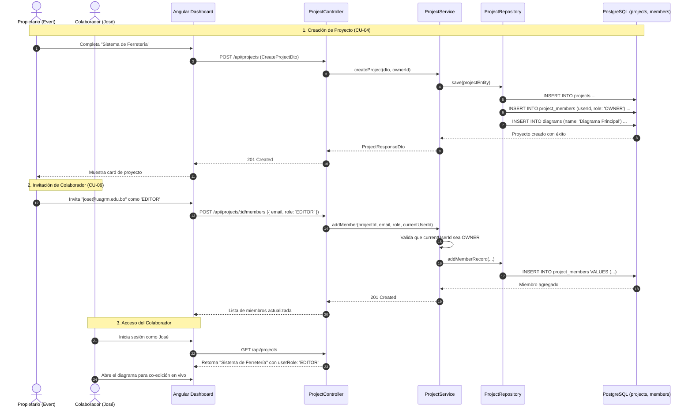

# 📁 Módulo de Gestión de Proyectos y Equipos (Projects Module)

## 📌 Descripción General
El **Módulo de Proyectos** gestiona la creación, configuración técnica (versión de Java, Spring Boot, paquete base), administración de miembros colaboradores y control de acceso basado en roles (**RBAC**: `OWNER`, `EDITOR`, `VIEWER`). Al crear un proyecto, el sistema inicializa automáticamente su diagrama UML principal.

---

## 🏛 Arquitectura en 5 Capas (Backend)

```
src/modules/projects/
├── controllers/          # [Capa 1] Controladores REST & Swagger (ProjectController, MemberController)
├── services/             # [Capa 2] Lógica de Negocio y Validación de Roles (ProjectService)
├── repositories/         # [Capa 3] Acceso a Datos TypeORM (ProjectRepository, ProjectMemberRepository)
├── entities/             # [Capa 4] Entidades 'projects' y 'project_members'
├── dtos/                 # [Capa 5] DTOs de Validación de Entrada y Salida
└── guards/               # ProjectRoleGuard para verificación de permisos granulares
```

---

## 👥 Matriz de Roles y Permisos en el Proyecto

| Acción / Operación | OWNER (Propietario) | EDITOR (Colaborador) | VIEWER (Espectador) |
| :--- | :---: | :---: | :---: |
| Ver Detalles y Listado del Proyecto | ✅ | ✅ | ✅ |
| Abrir y Ver Diagrama en Tiempo Real | ✅ | ✅ | ✅ |
| Editar Metadatos del Proyecto (`nombre`, `paquete`, `javaVersion`) | ✅ | ✅ | ❌ |
| Modificar Clases y Relaciones UML en el Canvas | ✅ | ✅ | ❌ (Solo Lectura) |
| Invitar Nuevos Miembros al Proyecto | ✅ | ❌ | ❌ |
| Cambiar Rol de Miembros (`EDITOR` ↔ `VIEWER`) | ✅ | ❌ | ❌ |
| Expulsar Miembros del Proyecto | ✅ | ❌ | ❌ |
| Eliminar Proyecto Completo y Diagramas | ✅ | ❌ | ❌ |

---

## 📋 Casos de Uso del Módulo

### 🔹 CU-04: Creación de Nuevo Proyecto UML
* **Actor Principal:** Usuario Autenticado.
* **Flujo Principal:**
  1. El usuario hace clic en `+ Nuevo Proyecto` y completa el formulario (`name`, `description`, `basePackage`, `javaVersion: 17|21`, `springBootVersion`).
  2. El frontend envía `POST /api/projects`.
  3. `ProjectService` crea el proyecto asociando al usuario autenticado como `OWNER` en la tabla `project_members`.
  4. Se crea automáticamente el diagrama de clases raíz ("Diagrama Principal") para inicializar el workspace.
  5. Se responde con `201 Created` y el proyecto se lista en la pantalla del usuario.

---

### 🔹 CU-05: Modificación de Configuración del Proyecto
* **Actor Principal:** `OWNER` o `EDITOR`.
* **Flujo Principal:**
  1. El usuario abre el modal `Editar Proyecto`.
  2. Modifica el nombre, descripción, paquete base (`e.g. com.uagrm.ventas`) o versiones de Java/Spring Boot.
  3. El frontend envía `PUT /api/projects/:id`.
  4. `ProjectService` valida que el usuario sea `OWNER` o `EDITOR` del proyecto.
  5. Se actualizan los datos en PostgreSQL y se retorna el proyecto actualizado (`200 OK`).

---

### 🔹 CU-06: Invitación de Miembros y Asignación de Roles
* **Actor Principal:** `OWNER`.
* **Precondición:** El usuario a invitar debe estar registrado en el sistema.
* **Flujo Principal:**
  1. El propietario abre el panel `Miembros del Proyecto`.
  2. Ingresa el correo electrónico del colaborador (ej. `jose@uagrm.edu.bo`) y selecciona el rol (`EDITOR` o `VIEWER`).
  3. El frontend envía `POST /api/projects/:id/members`.
  4. `ProjectService` busca el usuario por email y valida que no sea miembro actualmente.
  5. Se inserta el registro en `project_members` y se responde con `201 Created`.

---

### 🔹 CU-07: Modificación de Rol de un Miembro
* **Actor Principal:** `OWNER`.
* **Flujo Principal:**
  1. El propietario selecciona un miembro y cambia su rol (`EDITOR` ↔ `VIEWER`).
  2. El frontend envía `PATCH /api/projects/:id/members/:memberId/role` con `{ role: "VIEWER" }`.
  3. Se actualiza el rol en base de datos. Si el usuario afectado está en el diagrama, sus permisos se ajustan en caliente a modo solo lectura.

---

### 🔹 CU-08: Eliminación de Proyecto
* **Actor Principal:** `OWNER`.
* **Flujo Principal:**
  1. El propietario confirma la eliminación del proyecto.
  2. El frontend envía `DELETE /api/projects/:id`.
  3. Se eliminan en cascada los miembros, diagramas, nodos, conexiones y sesiones de colaboración asociadas.
  4. Se responde con `200 OK` (`{ success: true, message: 'Proyecto eliminado correctamente' }`).

---

## 📊 Diagrama de Secuencia Mermaid: Gestión de Proyectos y Miembros



---

## 🔌 Especificación de Endpoints REST

| Método | Ruta | Seguridad | Roles Permitidos | Descripción |
| :--- | :--- | :---: | :---: | :--- |
| `GET` | `/api/projects` | Bearer JWT | Todos | Lista los proyectos propios y compartidos del usuario |
| `POST` | `/api/projects` | Bearer JWT | Todos | Crea un nuevo proyecto y diagrama inicial |
| `GET` | `/api/projects/:id` | Bearer JWT | `OWNER`, `EDITOR`, `VIEWER` | Obtiene el detalle del proyecto con sus miembros |
| `PUT` | `/api/projects/:id` | Bearer JWT | `OWNER`, `EDITOR` | Modifica configuración técnica y metadatos |
| `DELETE` | `/api/projects/:id` | Bearer JWT | `OWNER` | Elimina el proyecto y todos sus diagramas en cascada |
| `POST` | `/api/projects/:id/members` | Bearer JWT | `OWNER` | Invita un nuevo usuario por email con rol asignado |
| `PATCH` | `/api/projects/:id/members/:memberId/role` | Bearer JWT | `OWNER` | Cambia el rol de un miembro (`EDITOR` o `VIEWER`) |
| `DELETE` | `/api/projects/:id/members/:memberId` | Bearer JWT | `OWNER` | Expulsa a un colaborador del proyecto |

---

## 📦 Data Transfer Objects (DTOs)

### 1. `CreateProjectDto`
```typescript
export class CreateProjectDto {
  @ApiProperty({ example: 'Sistema de Ventas' })
  @IsString()
  @IsNotEmpty()
  name: string;

  @ApiProperty({ example: 'Microservicio de ventas y facturación' })
  @IsOptional()
  @IsString()
  description?: string;

  @ApiProperty({ example: 'com.uagrm.ventas', default: 'com.example.uml' })
  @IsOptional()
  @IsString()
  basePackage?: string;

  @ApiProperty({ example: 21, default: 21 })
  @IsOptional()
  @IsInt()
  javaVersion?: number;

  @ApiProperty({ example: '3.3.0', default: '3.3.0' })
  @IsOptional()
  @IsString()
  springBootVersion?: string;
}
```

### 2. `AddMemberDto`
```typescript
export class AddMemberDto {
  @ApiProperty({ example: 'jose@uagrm.edu.bo' })
  @IsEmail()
  @IsNotEmpty()
  email: string;

  @ApiProperty({ enum: ['EDITOR', 'VIEWER'], default: 'EDITOR' })
  @IsEnum(['EDITOR', 'VIEWER'])
  role: 'EDITOR' | 'VIEWER';
}
```

---

## 🧪 Pruebas Unitarias
Cobertura ejecutada mediante `npm test` en backend:
* `project.service.spec.ts`: Pruebas de CRUD de proyectos, inicialización automática de diagrama, invitaciones de miembros y validación de permisos de rol.
* `project.controller.spec.ts`: Cobertura de endpoints REST HTTP de proyectos y miembros.
