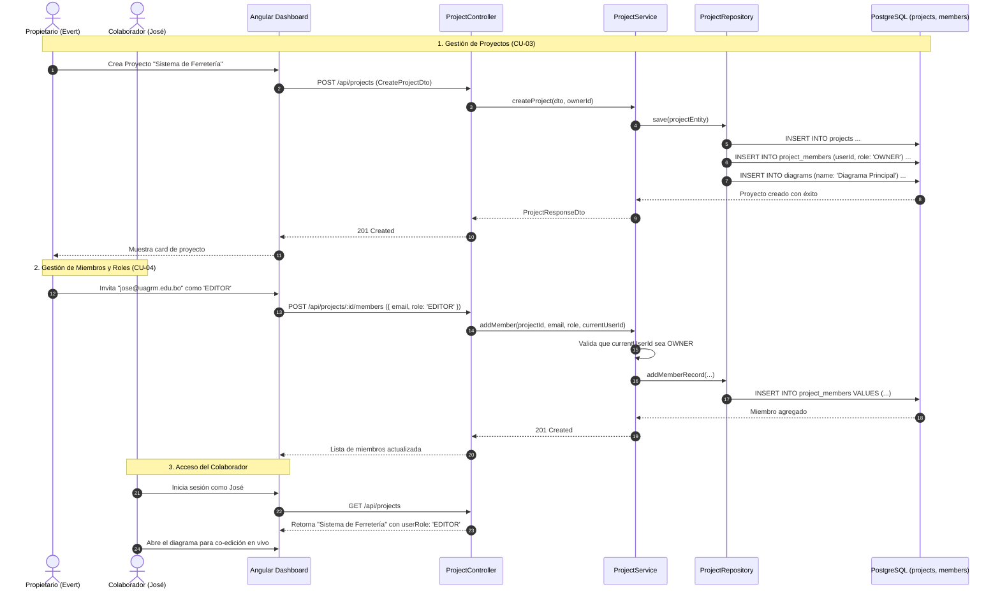

# 📁 Módulo de Gestión de Proyectos y Equipos (Projects Module)

## 📌 Descripción General
El **Módulo de Proyectos** gestiona la creación, configuración técnica (versión de Java, Spring Boot, paquete base), administración de miembros colaboradores y control de acceso basado en roles (**RBAC**: `OWNER`, `EDITOR`, `VIEWER`). Al crear un proyecto, el sistema inicializa automáticamente su diagrama UML principal.

---

## 🏛 Arquitectura en 5 Capas (Backend)

```
src/modules/projects/
├── controllers/          # [Capa 1] Controladores REST & Swagger (ProjectController, MemberController)
├── services/             # [Capa 2] Lógica de Negocio y Validación de Roles (ProjectService)
├── repositories/         # [Capa 3] Acceso a Datos TypeORM (ProjectRepository, ProjectMemberRepository)
├── entities/             # [Capa 4] Entidades 'projects' y 'project_members'
├── dtos/                 # [Capa 5] DTOs de Validación de Entrada y Salida
└── guards/               # ProjectRoleGuard para verificación de permisos granulares
```

---

## 👥 Matriz de Roles y Permisos en el Proyecto

| Acción / Operación | OWNER (Propietario) | EDITOR (Colaborador) | VIEWER (Espectador) |
| :--- | :---: | :---: | :---: |
| Ver Detalles y Listado del Proyecto | ✅ | ✅ | ✅ |
| Abrir y Ver Diagrama en Tiempo Real | ✅ | ✅ | ✅ |
| Editar Metadatos del Proyecto (`nombre`, `paquete`, `javaVersion`) | ✅ | ✅ | ❌ |
| Modificar Clases y Relaciones UML en el Canvas | ✅ | ✅ | ❌ (Solo Lectura) |
| Invitar Nuevos Miembros al Proyecto | ✅ | ❌ | ❌ |
| Cambiar Rol de Miembros (`EDITOR` ↔ `VIEWER`) | ✅ | ❌ | ❌ |
| Expulsar Miembros del Proyecto | ✅ | ❌ | ❌ |
| Eliminar Proyecto Completo y Diagramas | ✅ | ❌ | ❌ |

---

## 📋 Casos de Uso del Módulo

### 🔹 CU-02. Gestión de Proyectos

| Campo | Detalle |
| :--- | :--- |
| **Nombre de CU** | CU-02. Gestión de Proyectos |
| **Propósito** | Permitir al ingeniero anfitrión crear proyectos de modelado UML, definir paquetes base y versiones tecnológicas (Java/Spring Boot), actualizar metadatos y eliminar proyectos en cascada. |
| **Actores** | A1 (Ingeniero Anfitrión / OWNER), A2 (Ingeniero Colaborador / EDITOR) |
| **Actor iniciador** | A1 (OWNER) |
| **Precondición** | Usuario autenticado con sesión JWT activa. Para modificación o eliminación, permisos correspondientes según rol. |
| **Flujo principal** | **Crear Proyecto:**<br>• Clic en `+ Nuevo Proyecto`.<br>• Ingresar datos técnicos: `name`, `description`, `basePackage` (ej: `com.empresa.app`), `javaVersion` (17 o 21) y `springBootVersion`.<br>• El sistema persiste el proyecto, asigna al creador como `OWNER` en `project_members` y genera automáticamente el diagrama de clases raíz ("Diagrama Principal").<br><br>**Modificar Proyecto:**<br>• Abrir modal de configuración de proyecto.<br>• Modificar nombre, descripción, paquete base o versiones de compilación y guardar cambios.<br>• El sistema actualiza los registros en la base de datos.<br><br>**Eliminar Proyecto:**<br>• El anfitrión (`OWNER`) confirma la eliminación del proyecto.<br>• El backend ejecuta borrado en cascada eliminando miembros, diagramas, nodos, conexiones, sesiones y versiones.<br><br>**Listar Proyectos:**<br>• El usuario visualiza la lista de proyectos propios y compartidos con indicador de rol (`OWNER`, `EDITOR`, `VIEWER`). |
| **Postcondición** | Proyecto creado/actualizado o eliminado en PostgreSQL con su diagrama raíz disponible. |
| **Excepción** | • **Nombre Vacío o Inválido:** HTTP `400 Bad Request`.<br>• **Eliminación por No Propietario:** HTTP `403 Forbidden` ("Solo el propietario puede eliminar el proyecto"). |

---

### 🔹 CU-03. Gestión de Miembros y Roles

| Campo | Detalle |
| :--- | :--- |
| **Nombre de CU** | CU-03. Gestión de Miembros y Roles |
| **Propósito** | Administrar el equipo de trabajo del proyecto mediante invitación por correo institucional, asignación de roles RBAC (`EDITOR` / `VIEWER`) y revocación de accesos. |
| **Actores** | A1 (Ingeniero Anfitrión / OWNER) |
| **Actor iniciador** | A1 (OWNER) |
| **Precondición** | El usuario iniciador debe tener el rol `OWNER` del proyecto; los usuarios a invitar deben estar registrados en la plataforma. |
| **Flujo principal** | **Invitar Miembro:**<br>• Abrir el panel de miembros del proyecto.<br>• Ingresar correo electrónico del colaborador (ej. `jose@uagrm.edu.bo`) y seleccionar rol inicial (`EDITOR` o `VIEWER`).<br>• El sistema valida la existencia del usuario, comprueba que no sea miembro y crea el registro en `project_members`.<br><br>**Modificar Rol de Colaborador:**<br>• Seleccionar miembro en la tabla de miembros.<br>• Cambiar rol (`EDITOR` $\leftrightarrow$ `VIEWER`) y confirmar.<br>• Si el usuario está conectado en vivo al diagrama, sus privilegios de edición se ajustan en caliente.<br><br>**Expulsar Miembro:**<br>• Clic en botón "Eliminar miembro" y confirmar acción.<br>• El sistema revoca el acceso del usuario y cierra sus sesiones de colaboración asociadas. |
| **Postcondición** | Colaborador vinculado, actualizado o revocado en el proyecto. |
| **Excepción** | • **Usuario No Encontrado:** HTTP `404 Not Found` ("El usuario no existe").<br>• **Miembro Ya Registrado:** HTTP `409 Conflict` ("El usuario ya es miembro de este proyecto").<br>• **Acción no autorizada:** HTTP `403 Forbidden` si un no-propietario intenta gestionar miembros. |

---

## 📊 Diagrama de Secuencia Mermaid: Gestión de Proyectos y Miembros



---

## 🧪 Casos de Prueba (Test Cases)

| ID Caso de Prueba | Caso de Uso | Descripción / Escenario | Precondiciones | Datos de Entrada | Pasos de Ejecución | Resultado Esperado | Resultado Real | Estado |
|---|---|---|---|---|---|---|---|:---:|
| **TC_CU02_01** | CU-02 | Creación de nuevo proyecto con diagrama inicial (Camino feliz) | Usuario autenticado | `name`: "Gestión Ventas", `basePackage`: "com.uagrm.ventas", `javaVersion`: 21 | 1. Clic en "+ Nuevo Proyecto".<br>2. Llenar formulario y enviar. | Código HTTP `201 Created`, proyecto creado con usuario como OWNER y diagrama raíz generado. | Proyecto guardado en PostgreSQL, diagrama inicial disponible en dashboard. | **Aprobado (Pass)** |
| **TC_CU02_02** | CU-02 | Creación de proyecto con nombre vacío (Datos inválidos) | Usuario autenticado | `name`: "", `basePackage`: "com.test" | 1. Intentar enviar formulario con campo nombre vacío. | Código HTTP `400 Bad Request` indicando "name should not be empty". | El formulario valida el campo y la API rechaza la petición con 400. | **Aprobado (Pass)** |
| **TC_CU02_03** | CU-02 | Modificación de configuración técnica del proyecto (Camino feliz) | Usuario con rol OWNER o EDITOR | `name`: "Gestión Ventas v2", `basePackage`: "com.uagrm.v2", `javaVersion`: 21 | 1. Clic en "Editar Proyecto".<br>2. Cambiar nombre y paquete.<br>3. Guardar cambios. | Código HTTP `200 OK`, metadatos del proyecto actualizados. | Proyecto modificado en base de datos y reflejado de inmediato en UI. | **Aprobado (Pass)** |
| **TC_CU02_04** | CU-02 | Eliminación de proyecto y cascada relacional por OWNER (Camino feliz) | Usuario autenticado es OWNER | `projectId`: ID válido | 1. Clic en "Eliminar Proyecto".<br>2. Confirmar diálogo de alerta. | Código HTTP `200 OK`, proyecto, miembros y diagramas eliminados de la BD. | Registro eliminado exitosamente con borrado en cascada TypeORM. | **Aprobado (Pass)** |
| **TC_CU02_05** | CU-02 | Intento de eliminación de proyecto por EDITOR/VIEWER (Flujo alterno) | Usuario autenticado con rol EDITOR | `projectId`: ID del proyecto | 1. Enviar petición `DELETE /api/projects/:id`. | Código HTTP `403 Forbidden` indicando "Solo el propietario puede eliminar el proyecto". | La API rechaza la operación con código 403. | **Aprobado (Pass)** |
| **TC_CU03_01** | CU-03 | Invitación de nuevo miembro colaborador con rol EDITOR (Camino feliz) | Usuario autenticado es OWNER; usuario a invitar registrado | `email`: "jose@uagrm.edu.bo", `role`: "EDITOR" | 1. Abrir panel "Miembros".<br>2. Ingresar email y rol.<br>3. Clic en "Invitar". | Código HTTP `201 Created`, miembro vinculado al proyecto. | Registro insertado en `project_members` y listado en la interfaz. | **Aprobado (Pass)** |
| **TC_CU03_02** | CU-03 | Invitación de usuario no registrado en el sistema (Flujo alterno) | Usuario a invitar no existe | `email`: "inexistente@correo.com", `role`: "EDITOR" | 1. Intentar invitar correo no registrado.<br>2. Clic en "Invitar". | Código HTTP `404 Not Found` indicando "El usuario no existe". | Retorna error 404 y muestra alerta al propietario. | **Aprobado (Pass)** |
| **TC_CU03_03** | CU-03 | Modificación de rol de EDITOR a VIEWER (Camino feliz) | Miembro activo en el proyecto; ejecutor es OWNER | `memberId`: ID del miembro, `role`: "VIEWER" | 1. Seleccionar miembro.<br>2. Cambiar selector a "VIEWER". | Código HTTP `200 OK`, rol del miembro modificado a VIEWER. | Rol actualizado en BD; el usuario afectado pasa a modo solo lectura. | **Aprobado (Pass)** |
| **TC_CU03_04** | CU-03 | Expulsión de miembro por parte del OWNER (Camino feliz) | Miembro activo en el proyecto | `memberId`: ID del miembro | 1. Clic en botón "Eliminar miembro".<br>2. Confirmar expulsión. | Código HTTP `200 OK`, miembro revocado del proyecto. | Registro eliminado de `project_members`; se restringe su acceso. | **Aprobado (Pass)** |

---

## 🔌 Especificación de Endpoints REST

| Método | Ruta | Seguridad | Roles Permitidos | Descripción |
| :--- | :--- | :---: | :---: | :--- |
| `GET` | `/api/projects` | Bearer JWT | Todos | Lista los proyectos propios y compartidos del usuario |
| `POST` | `/api/projects` | Bearer JWT | Todos | Crea un nuevo proyecto y diagrama inicial |
| `GET` | `/api/projects/:id` | Bearer JWT | `OWNER`, `EDITOR`, `VIEWER` | Obtiene el detalle del proyecto con sus miembros |
| `PUT` | `/api/projects/:id` | Bearer JWT | `OWNER`, `EDITOR` | Modifica configuración técnica y metadatos |
| `DELETE` | `/api/projects/:id` | Bearer JWT | `OWNER` | Elimina el proyecto y todos sus diagramas en cascada |
| `POST` | `/api/projects/:id/members` | Bearer JWT | `OWNER` | Invita un nuevo usuario por email con rol asignado |
| `PATCH` | `/api/projects/:id/members/:memberId/role` | Bearer JWT | `OWNER` | Cambia el rol de un miembro (`EDITOR` o `VIEWER`) |
| `DELETE` | `/api/projects/:id/members/:memberId` | Bearer JWT | `OWNER` | Expulsa a un colaborador del proyecto |

---

## 📦 Data Transfer Objects (DTOs)

### 1. `CreateProjectDto`
```typescript
export class CreateProjectDto {
  @ApiProperty({ example: 'Sistema de Ventas' })
  @IsString()
  @IsNotEmpty()
  name: string;

  @ApiProperty({ example: 'Microservicio de ventas y facturación' })
  @IsOptional()
  @IsString()
  description?: string;

  @ApiProperty({ example: 'com.uagrm.ventas', default: 'com.example.uml' })
  @IsOptional()
  @IsString()
  basePackage?: string;

  @ApiProperty({ example: 21, default: 21 })
  @IsOptional()
  @IsInt()
  javaVersion?: number;

  @ApiProperty({ example: '3.3.0', default: '3.3.0' })
  @IsOptional()
  @IsString()
  springBootVersion?: string;
}
```

### 2. `AddMemberDto`
```typescript
export class AddMemberDto {
  @ApiProperty({ example: 'jose@uagrm.edu.bo' })
  @IsEmail()
  @IsNotEmpty()
  email: string;

  @ApiProperty({ enum: ['EDITOR', 'VIEWER'], default: 'EDITOR' })
  @IsEnum(['EDITOR', 'VIEWER'])
  role: 'EDITOR' | 'VIEWER';
}
```
