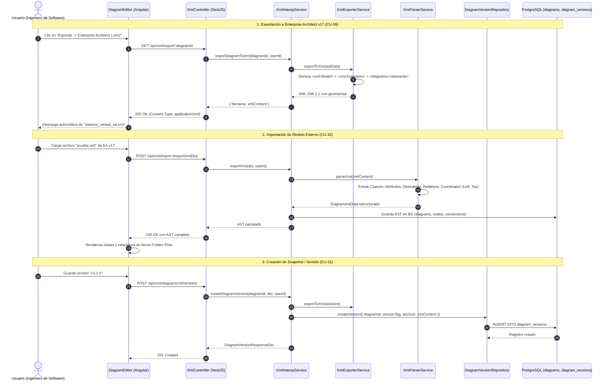

# 🔄 Módulo de Interoperabilidad XMI 2.1 y Versionado (XMI Interop Module)

## 📌 Descripción General
El **Módulo de Interoperabilidad XMI 2.1 y Versionado** proporciona el motor bidireccional para exportar e importar modelos y diagramas de clases UML entre la plataforma web colaborativa y herramientas CASE tradicionales de la industria, principalmente **Enterprise Architect v17 (Sparx Systems)**. Además, administra el versionado inmutable y snapshots históricos del Árbol de Sintaxis Abstracta (**AST**) asociados a etiquetas semánticas (`v1.0.0`, `snapshot-2026`).

A diferencia de exportadores genéricos que omiten la capa de presentación visual, este módulo genera e interpreta la sección `<xmi:Extension extender="Enterprise Architect"><diagrams><diagram><elements>` con coordenadas geométricas precisas (`Left`, `Top`, `Right`, `Bottom`), permitiendo que al abrir el archivo `.xmi` en Enterprise Architect se dibuje inmediatamente el diagrama con todas las cajas de clases, compartimentos de atributos/operaciones y líneas de relaciones en su posición exacta.

---

## 🏛 Arquitectura en 5 Capas (Backend)

```
src/modules/xmi-interop/
├── controllers/          # [Capa 1] Endpoints REST & Swagger (XmiController)
├── services/             # [Capa 2] Motores de Serialización y Parseo (XmiExporterService, XmiParserService, XmiInteropService)
├── repositories/         # [Capa 3] Acceso a Datos de Versionado (DiagramVersionRepository)
├── entities/             # [Capa 4] Esquema Relacional ('diagram_versions')
└── dtos/                 # [Capa 5] DTOs de Transferencia y Validación (ImportXmiDto, ExportAstToXmiDto, CreateDiagramVersionDto)
```

---

## 📐 Estructura y Compatibilidad XMI 2.1 (Enterprise Architect v17)

| Componente XML / XMI | Propósito en Enterprise Architect | Detalle Técnico |
| :--- | :--- | :--- |
| `<uml:Model>` | Estructura semántica del modelo UML 2.1 | Contiene `<packagedElement>` para clases, atributos, métodos y asociaciones. |
| `<xmi:Extension>` | Metadatos propietarios de Sparx EA | Almacena configuraciones de proyecto, visibilidad, tipos de datos y tags. |
| `<elements>` | Especificación de clases y paquetes en EA | Vincula los `xmi:id` con identificadores locales y atributos detallados. |
| `<connectors>` | Enlaces y relaciones semánticas | Define origen (`source`), destino (`target`), multiplicidades y tipo (`Association`, `Generalization`, `Composition`). |
| `<primitivetypes>` | Catálogo de tipos de datos Java/UML | Define paquetes para `EAJava_uuid`, `EAJava_String`, `EAJava_int`, `EAJava_Date`, etc. |
| `<diagrams><diagram>` | **Lienzo gráfico y dibujo del diagrama** | Contiene `<elements><element geometry="Left=X;Top=Y;Right=X+W;Bottom=Y+H;" subject="EAID_..." style="DUID=HEX;"/>` |

---

## 📋 Casos de Uso del Módulo

### 🔹 CU-09: Exportación XMI 2.1 con Geometría de Diagrama (Enterprise Architect v17)
* **Actor Principal:** Usuario Autenticado (`OWNER`, `EDITOR`, `VIEWER`).
* **Descripción:** Transforma el estado actual del lienzo (clases, coordenadas $X/Y$, dimensiones, atributos, métodos y relaciones) en un archivo `.xmi` compatible con Enterprise Architect v17 y suites CASE estándar.
* **Flujo Principal:**
  1. El usuario despliega el menú `Exportar ▾` y selecciona `Enterprise Architect (.xmi)`.
  2. El sistema serializa el AST generando la estructura XML XMI 2.1 completa con las coordenadas exactas de cada clase en `<diagrams><diagram><elements>`.
  3. El navegador descarga automáticamente el archivo `${diagram_name}_ea.xmi`.
  4. Al importar el archivo en Enterprise Architect v17 (`Publish -> Import-XML -> Import Package from XMI`), EA crea el paquete y **abre inmediatamente el diagrama dibujado con todas sus clases y conectores**.

---

### 🔹 CU-10: Importación Bidireccional de Archivos XMI / XML
* **Actor Principal:** Usuario con rol `OWNER` o `EDITOR`.
* **Descripción:** Analiza documentos XML/XMI 2.1 exportados desde Enterprise Architect u otras herramientas CASE, extrayendo clases, compartimentos y geometría para reconstruir el diagrama en el lienzo.
* **Flujo Principal:**
  1. El usuario hace clic en `Importar ▾ -> Cargar Archivo .xml / .xmi`.
  2. Selecciona un archivo local (ej. `prueba.xml`).
  3. El parser extrae las clases, atributos, métodos, multiplicidades y las coordenadas `Left/Top`.
  4. El lienzo de Foblex Flow se limpia y se renderiza fielmente el modelo importado, sincronizándose con la base de datos y los colaboradores en tiempo real.

---

### 🔹 CU-11: Versionado Inmutable y Snapshots de Diagramas
* **Actor Principal:** Usuario con rol `OWNER` o `EDITOR`.
* **Descripción:** Permite capturar snapshots históricos congelados del diagrama con su correspondiente XMI 2.1 para auditoría, control de cambios y restauración instantánea.
* **Flujo Principal:**
  1. El usuario abre la sección de historial de versiones.
  2. Ingresa una etiqueta semántica (ej. `v1.0.0 - Release Inicial`) y guarda el snapshot.
  3. El sistema almacena en `diagram_versions` el AST JSON y el XMI generado con autoría y fecha.
  4. En cualquier momento, el usuario puede seleccionar una versión previa y presionar "Restaurar" para volver el diagrama a ese punto en el tiempo.

---

## 📊 Diagrama de Secuencia Mermaid: Exportación, Importación y Versionado XMI



---

## 🧪 Casos de Prueba (Test Cases)

| ID Caso de Prueba | Caso de Uso | Descripción / Escenario | Precondiciones | Datos de Entrada | Pasos de Ejecución | Resultado Esperado | Resultado Real | Estado |
|---|---|---|---|---|---|---|---|:---:|
| **TC_CU09_01** | CU-09 | Exportación XMI 2.1 con clases, atributos y métodos (Camino feliz) | Diagrama activo con clases en BD | `diagramId`: "diag-1" | 1. Solicitar `GET /api/xmi/export/diag-1`.<br>2. Validar respuesta XML. | Genera XML XMI 2.1 con `<uml:Model>`, `<packagedElement xmi:type="uml:Class">` y tipos de atributos. | Archivo XMI 2.1 generado con estructura completa de clases y operaciones. | **Aprobado (Pass)** |
| **TC_CU09_02** | CU-09 | Inclusión de sección `<diagrams>` con coordenadas exactas para EA v17 | Clases posicionadas en (x:100, y:150) | `diagramId`: "diag-1" | 1. Exportar XMI.<br>2. Buscar tag `<diagrams>`. | Contiene `<element geometry="Left=100;Top=150;Right=320;Bottom=290;" subject="EAID_..." style="DUID=...;"/>`. | Geometría exacta generada para renderizado automático en EA v17. | **Aprobado (Pass)** |
| **TC_CU09_03** | CU-09 | Exportación de relaciones y multiplicidades UML (Composición, Agregación, etc.) | Clases conectadas con relación 1:N | Relación `composition`, sMult: "1", tMult: "0..*" | 1. Exportar XMI.<br>2. Inspeccionar `<connectors>`. | Conector generado con `aggregation="composite"`, `lb="1"`, `rb="0..*"`. | Conectores y multiplicidades exportadas en `<connectors>` y `<packagedElement>`. | **Aprobado (Pass)** |
| **TC_CU10_01** | CU-10 | Parseo exitoso de archivo `prueba.xml` exportado desde EA v17 (Camino feliz) | Archivo XML válido de EA v17 | Contenido de `prueba.xml` | 1. Ejecutar `xmiParserService.parseXmi(xml)`. | Extrae tablas `users`, `users - Copy`, `users - Copy1` con sus coordenadas `(54, 21)` y `(55, 246)`. | Nodos, atributos, métodos y posiciones extraídas fielmente. | **Aprobado (Pass)** |
| **TC_CU10_02** | CU-10 | Importación XMI con guardado persistente en base de datos (Camino feliz) | Usuario con rol EDITOR en proyecto | `xmiContent`, `projectId`: "proj-1" | 1. POST `/api/xmi/import`. | Crea diagrama en base de datos e inserta nodos y conexiones relacionales. | Diagrama creado y retornado con ID asignado. | **Aprobado (Pass)** |
| **TC_CU10_03** | CU-10 | Validación de contenido XML vacío o corrupto | Entrada inválida | `xmiContent`: "" | 1. POST `/api/xmi/import` con body vacío. | Retorna error HTTP 400 Bad Request con mensaje descriptivo. | Excepción `BadRequestException` lanzada y controlada. | **Aprobado (Pass)** |
| **TC_CU11_01** | CU-11 | Creación de versión snapshot inmutable (Camino feliz) | Diagrama existente en BD | `versionTag`: "v1.0.0" | 1. POST `/api/xmi/diagrams/:id/versions`. | Crea registro en `diagram_versions` con AST y XMI congelado. | Registro persistido con ID y timestamp de creación. | **Aprobado (Pass)** |
| **TC_CU11_02** | CU-11 | Listado cronológico de versiones de un diagrama (Camino feliz) | Diagrama con versiones previas | `diagramId`: "diag-1" | 1. GET `/api/xmi/diagrams/:id/versions`. | Retorna array de versiones ordenado descendentemente por fecha. | Lista de versiones retornada con nombres de creadores y tags. | **Aprobado (Pass)** |
| **TC_CU11_03** | CU-11 | Restauración de diagrama a una versión histórica (Camino feliz) | Versión existente "v1.0.0" | `versionId`: "ver-1" | 1. POST `/api/xmi/diagrams/:id/versions/ver-1/restore`. | Sobrescribe el AST activo con el AST congelado en la versión. | Diagrama actualizado en base de datos y retornado para refresco en frontend. | **Aprobado (Pass)** |

---

## 🔌 Especificación de Endpoints REST

| Método | Ruta | Seguridad | Roles Permitidos | Descripción |
| :--- | :--- | :---: | :---: | :--- |
| `GET` | `/api/xmi/export/:diagramId` | Bearer JWT | Todos los miembros | Descarga el archivo `.xmi` (XMI 2.1) con soporte de dibujo para EA v17 |
| `POST` | `/api/xmi/export-ast` | Bearer JWT | Todos los miembros | Exporta directamente un AST JSON a XMI 2.1 para descarga en caliente |
| `POST` | `/api/xmi/import` | Bearer JWT | `OWNER`, `EDITOR` | Importa y parsea un archivo XMI/XML 2.1 (crea o actualiza en BD si se indica) |
| `POST` | `/api/xmi/diagrams/:diagramId/versions` | Bearer JWT | `OWNER`, `EDITOR` | Crea un snapshot/versión congelada del diagrama con su AST y XMI |
| `GET` | `/api/xmi/diagrams/:diagramId/versions` | Bearer JWT | Todos los miembros | Lista todas las versiones históricas del diagrama |
| `GET` | `/api/xmi/diagrams/:diagramId/versions/:versionId` | Bearer JWT | Todos los miembros | Obtiene los detalles y el XMI de una versión histórica |
| `POST` | `/api/xmi/diagrams/:diagramId/versions/:versionId/restore` | Bearer JWT | `OWNER`, `EDITOR` | Restaura el estado activo del diagrama al AST de la versión indicada |
